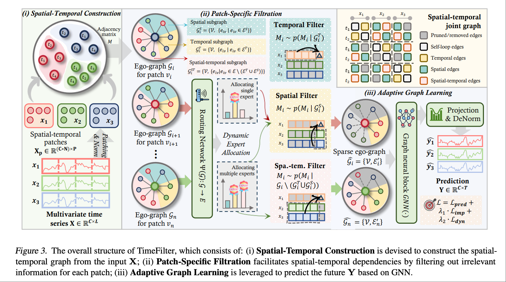
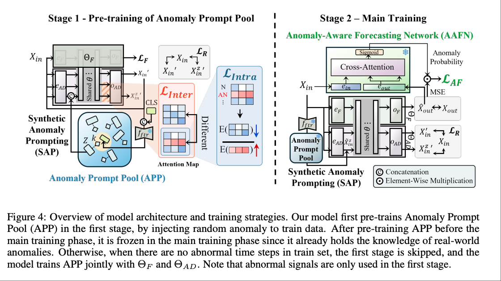
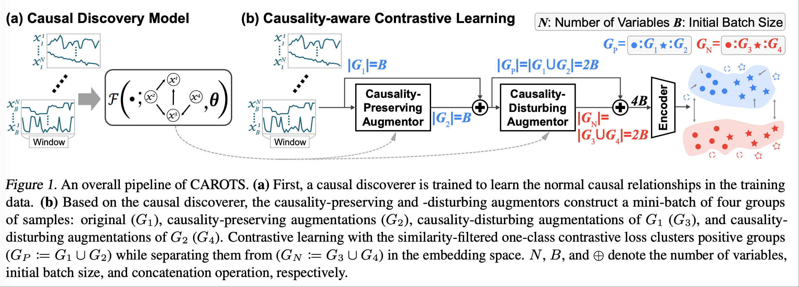

# ICML 2025 | 时间序列(Time Series)论文总结

**会议时间**: 2025年7月13日至7月19日  
**地点**: 温哥华会议中心  
**论文总数**: 63篇  

## 时间序列主题
预测，分类，异常检测，生成，因果发现，基础模型，大语言模型等。

---

## 论文列表

### 预测相关
1. **TimeDART: A Diffusion Autoregressive Transformer for Self-Supervised Time Series Representation**  
   - 链接: [https://icml.cc/virtual/2025/poster/43701](https://icml.cc/virtual/2025/poster/43701)  
   - 作者: Daoyu Wang, Mingyue Cheng, Zhiding Liu, Qi Liu  
   - 关键词: 预测，自回归，自监督
   - **Abstract**: Self-supervised learning has garnered increasing attention in time series analysis for benefiting various downstream tasks and reducing reliance on labeled data. Despite its effectiveness, existing methods often struggle to comprehensively capture both long-term dynamic evolution and subtle local patterns in a unified manner. In this work, we propose TimeDART, a novel self-supervised time series pre-training framework that unifies two powerful generative paradigms to learn more transferable representations. Specifically, we first employ a causal Transformer encoder, accompanied by a patch-based embedding strategy, to model the evolving trends from left to right. Building on this global modeling, we further introduce a denoising diffusion process to capture fine-grained local patterns through forward diffusion and reverse denoising. Finally, we optimize the model in an autoregressive manner. As a result, TimeDART effectively accounts for both global and local sequence features in a coherent way. We conduct extensive experiments on public datasets for time series forecasting and classification. The experimental results demonstrate that TimeDART consistently outperforms previous compared methods, validating the effectiveness of our approach. Our code is available at https://github.com/Melmaphother/TimeDART.
   - **动机**：当前自监督时间序列学习方法在捕捉长程动态与局部细节方面存在挑战：（1）基于自动回归（autoregressive）的方法虽符合时序自然趋势，但容易过拟合噪声、异常值；（2）扩散（diffusion）模型擅长恢复细节，但弱化全局依赖性。理想的自监督方法应同时兼具全局趋势建模和细粒度特征提取，以提升下游任务性能 。
   - **方法简述（Proposed Method）**：
    - 自回归 Transformer 编码器（causal Transformer）：采用 patch 级别嵌入与因果遮掩，捕捉序列全局动态；
    - 扩散+去噪机制：在每个 patch 中注入噪声，通过跨注意力（cross-attention）向经典 Transformer 提供修复信号，促进模型捕获局部结构；
   - **训练目标**
    - 使用扩散损失替代单纯 MSE，避免自动回归模型对高斯偏差的假设，允许对多模态分布更丰富建模 ；
    - 同时训练 autoregressive 与 diffusion 任务，以一致的特征学习目标提升表征质量。
   - **实验设置与数据集**
    - 时间序列预测（Forecasting）：PEMS（交通流量）、ETTh2, ETTm2（能源），Electricity 
    - 时间序列分类（Classification）：HAR（人体活动识别，来自可穿戴设备）、Epilepsy（癫痫发作 ECG 信号）、Sleep‑EEG（多通道 EEG 睡眠阶段分类
   

2. **Towards a General Time Series Forecasting Model with Unified Representation and Adaptive Transfer**  
   - 链接: [https://icml.cc/virtual/2025/poster/46383](https://icml.cc/virtual/2025/poster/46383)  
   - 作者: Yihang Wang, Yuying Qiu, Peng Chen, Kai Zhao, Yang Shu, Zhongwen Rao, Lujia Pan, Bin Yang, Chenjuan Guo  
   - 关键词: 预测，少样本，零样本

3. **TimeFilter: Patch-Specific Spatial-Temporal Graph Filtration for Time Series Forecasting**  
   - **链接**: [https://icml.cc/virtual/2025/poster/46502](https://icml.cc/virtual/2025/poster/46502)  
   - **作者**: Yifan Hu, Guibin Zhang, Peiyuan Liu, Disen Lan, Naiqi Li, Dawei Cheng, Tao Dai, Shutao Xia, Shirui Pan  
   - **关键词**: 预测，时空图，通道关系
   - **Abstract**: Time series forecasting methods generally fall into two main categories: Channel Independent (CI) and Channel Dependent (CD) strategies. While CI overlooks important covariate relationships, CD captures all dependencies without distinction, introducing noise and reducing generalization. Recent advances in Channel Clustering (CC) aim to refine dependency modeling by grouping channels with similar characteristics and applying tailored modeling techniques. However, coarse-grained clustering struggles to capture complex, time-varying interactions effectively. To address these challenges, we propose TimeFilter, a GNN-based framework for adaptive and fine-grained dependency modeling. After constructing the graph from the input sequence, TimeFilter refines the learned spatial-temporal dependencies by filtering out irrelevant correlations while preserving the most critical ones in a patch-specific manner. Extensive experiments on 13 real-world datasets from diverse application domains demonstrate the state-of-the-art performance of TimeFilter. The code is available at https://github.com/TROUBADOUR000/TimeFilter.
   - **动机**：现有多变量时间序列预测方法主要分为Channel Independent (CI) 和 Channel Dependent (CD) 两类。CI 方法忽视通道间相关性，CD 方法则盲目捕捉所有依赖，容易引入噪音，降低泛化能力。尽管通道聚类（Channel Clustering）提供了一些改进，但依然难以利用时变的模态间复杂交互。本论文提出：需要一种更细粒度、可以动态过滤噪音而非全量捕捉相关性的框架。
   - **方法简述（Proposed Method）**：
    - 论文提出了名为 TimeFilter 的新框架，采用图神经网络（GNN）在 patch 级别进行空间-时间依赖建模：
    - Patch‑Specific Filtration：对每个 patch 构建 3 类自环子图（时空、空间、时间），利用 Mixture-of-Experts 和动态路由机制为每个 patch 自适应地过滤无关边缘，仅保留重要依赖；
    - 自适应图学习 + GNN 聚合：使用图卷积在精炼后的依赖图上聚合信息，并最终进行未来预测；
   - **实验设置与数据集**
    - TimeFilter 在 13 个真实多变量时序数据集上测试，涵盖交通（PEMS 系列）、能源（Electricity、ETTh1/2、ETTm1/2）、医疗与金融等领域。结果显示，在长短期预测任务上均优于 CI/CD 和图神经多种基线模型，且 ablation 实验验证了 patch‑specific filer 与动态路由的关键作用。
   

4. **Enhancing Foundation Models for Time Series Forecasting via Wavelet-based Tokenization**  
   - **链接**: [https://icml.cc/virtual/2025/poster/46131](https://icml.cc/virtual/2025/poster/46131)  
   - **作者**: Luca Masserano, Abdul Fatir Ansari, Boran Han, Xiyuan Zhang, Christos Faloutsos, Michael Mahoney, Andrew Wilson, Youngsuk Park, Syama Sundar Yadav Rangapuram, Danielle Maddix, Yuyang Wang 论文由 Cornell University 和 多个工业团队（包括 AWS AI、Google Research、Stanford 等）合作完成 
   - **关键词**: 预测，基础模型，小波变换，token化
   - **Abstract**: How to best develop foundational models for time series forecasting remains an important open question. Tokenization is a crucial consideration in this effort: what is an effective discrete vocabulary for a real-valued sequential input? To address this question, we develop WaveToken, a wavelet-based tokenizer that allows models to learn complex representations directly in the space of time-localized frequencies. Our method first scales and decomposes the input time series, then thresholds and quantizes the wavelet coefficients, and finally pre-trains an autoregressive model to forecast coefficients for the forecast horizon. By decomposing coarse and fine structures in the inputs, wavelets provide an eloquent and compact language for time series forecasting that simplifies learning. Empirical results on a comprehensive benchmark, including 42 datasets for both in-domain and zeroshot settings, show that WaveToken: i) provides better accuracy than recently proposed foundation models for forecasting while using a much smaller vocabulary (1024 tokens), and performs on par or better than modern deep learning models trained specifically on each dataset; and ii) exhibits superior generalization capabilities, achieving the best average rank across all datasets for three complementary metrics. In addition, we show that our method can easily capture complex temporal patterns of practical relevance that are challenging for other recent pre-trained models, including trends, sparse spikes, and non-stationary time series with varying frequencies evolving over time.
   - **动机**：在构建 时间序列基础模型（foundation models） 时，关键挑战之一是如何将连续时间信号有效离散成可学习的 token。作者指出，现有 tokenization 方法往往要么过度依赖粗粒度采样、导致信息丢失；要么词表过大、难以训练和泛化。
   - **方法简述（Proposed Method）**：
    - 提出 WaveToken——一种基于小波变换的 tokenization 技术：将原始时序按不同时频尺度分解，量化阈值后形成有限词汇表（如 1024 tokens）；然后预训练自回归模型去预测未来小波系数，从而在频域结构上学习时间序列特征。该方法既保持了时频信息，又显著减少词表复杂度和显存占用。
   - **实验设置与数据集**
    - WaveToken 在包含 42（Electricity、Traffic（PEMS）、ETT、ETTm ） 个数据集的全面 benchmark 上评测，覆盖 in-domain 和 zero-shot 场景，结果显示其在多个常用任务中超越或匹配现有基础模型和针对性深度模型，并在泛化能力上表现优异。
   

5. **Time-VLM: Exploring Multimodal Vision-Language Models for Augmented Time Series Forecasting**  
   - **链接**: [https://icml.cc/virtual/2025/poster/44762](https://icml.cc/virtual/2025/poster/44762)  
   - **作者**: Siru Zhong, Weilin Ruan, Ming Jin, Huan Li, Qingsong Wen, Yuxuan Liang  
   - **关键词**: 预测，多模态，视觉语言模型
   - **Abstract**: Recent advancements in time series forecasting have explored augmenting models with text or vision modalities to improve accuracy. While text provides contextual understanding, it often lacks fine-grained temporal details. Conversely, vision captures intricate temporal patterns but lacks semantic context, limiting the complementary potential of these modalities.（虽然文本可以提供上下文理解，但它通常缺乏细粒度的时间细节。相反，视觉能够捕捉复杂的时间模式，但缺乏语义背景，从而限制了这两种模态的互补潜力。） To address this, we propose Time-VLM, a novel multimodal framework that leverages pre-trained Vision-Language Models (VLMs) to bridge temporal, visual, and textual modalities for enhanced forecasting. Our framework comprises three key components: (1) a Retrieval-Augmented Learner, which extracts enriched temporal features through memory bank interactions; (2) a Vision-Augmented Learner, which encodes time series as informative images; and (3) a Text-Augmented Learner, which generates contextual textual descriptions. These components collaborate with frozen pretrained VLMs to produce multimodal embeddings, which are then fused with temporal features for final prediction. Extensive experiments demonstrate that Time-VLM achieves superior performance, particularly in few-shot and zeroshot scenarios, thereby establishing a new direction for multimodal time series forecasting. Code is available at https://github.com/CityMind-Lab/ICML25-TimeVLM.
   - **动机**：时间序列预测在金融、气象、能源等领域具有重要应用。虽然已有模型尝试引入文本或视觉信息增强预测性能，但单一模态的方法仍存在语义理解不足或缺乏时序结构等局限。当前缺乏一个能同时整合文本、图像和时间序列数据的统一模型。因此，作者提出探索如何利用预训练视觉-语言模型（VLMs），统一三种模态信息，从而提升在数据稀缺场景下的预测性能与泛化能力。
   - **方法简述（Proposed Method）**：作者提出了Time-VLM，这是一个新颖的多模态预测框架，包含三个模块：（1）Retrieval-Augmented Learner (RAL) 用于从时间序列中提取丰富的时序特征；（2）Vision-Augmented Learner (VAL) 将时间序列转换为图像，以捕捉时空结构特征；（3）Text-Augmented Learner (TAL) 生成与时间序列相关的上下文语义文本。三个模块的输出通过**冻结的预训练VLM（如ViLT、CLIP）**进行融合，再输入至预测器生成最终预测结果。该框架无需外部图像或文本数据，能自行生成辅助模态以增强自身预测。
   - **实验设置与数据集**：
    作者在多个时间序列数据集上进行了实验，涵盖能源（ETTh1, ETTh2, ETTm1, ETTm2）、气象（Weather）、电力（ECL）、交通（Traffic）以及短期预测基准数据集M4，评估包括全监督、少样本（few-shot）与零样本（zero-shot）等场景。Time-VLM在多个指标（如MSE、MAE、SMAPE等）上均显著优于现有SOTA模型，尤其在数据稀缺条件下展现出强大的泛化能力。
   

6. **Lightweight Online Adaption for Time Series Foundation Model Forecasts**  
   - 链接: [https://icml.cc/virtual/2025/poster/44485](https://icml.cc/virtual/2025/poster/44485)  
   - 作者: Thomas Lee, William Toner, Rajkarn Singh, Artjom Joosen, Martin Asenov  
   - 关键词: 预测，基础模型，在线学习

7. **TimeStacker: A Novel Framework with Multilevel Observation for Capturing Nonstationary Patterns in Time Series Forecasting**  
   - 链接: [https://icml.cc/virtual/2025/poster/46428](https://icml.cc/virtual/2025/poster/46428)  
   - 作者: Qinglong Liu, Cong Xu, Wenhao Jiang, Kaixuan Wang, Lin Ma, Haifeng Li  
   - 关键词: 预测，非平稳性，多尺度

8. **AdaPTS: Adapting Univariate Foundation Models to Probabilistic Multivariate Time Series Forecasting**  
   - 链接: [https://icml.cc/virtual/2025/poster/43518](https://icml.cc/virtual/2025/poster/43518)  
   - 作者: Abdelhakim Benechehab, Vasilii Feofanov, Giuseppe Paolo, Albert Thomas, Maurizio Filippone, Balázs Kégl  
   - 关键词: 预测，基础模型，单变量，概率预测

9. **TimePro: Efficient Multivariate Long-term Time Series Forecasting with Variable- and Time-Aware Hyper-state**  
   - 链接: [https://icml.cc/virtual/2025/poster/43851](https://icml.cc/virtual/2025/poster/43851)  
   - 作者: Xiaowen Ma, Zhen-Liang Ni, Shuai Xiao, Xinghao Chen  
   - 关键词: 长时预测，变量感知，时间感知

10. **Breaking Silos: Adaptive Model Fusion Unlocks Better Time Series Forecasting**  
    - 链接: [https://icml.cc/virtual/2025/poster/43827](https://icml.cc/virtual/2025/poster/43827)  
    - 作者: Zhining Liu, Ze Yang, Xiao Lin, Ruizhong Qiu, Tianxin Wei, Yada Zhu, Hendrik Hamann, Jingrui He, Hanghang Tong  
    - 关键词: 预测，自适应

11. **TimeBridge: Non-Stationarity Matters for Long-term Time Series Forecasting**  
    - 链接: [https://icml.cc/virtual/2025/poster/43973](https://icml.cc/virtual/2025/poster/43973)  
    - 作者: Peiyuan Liu, Beiliang Wu, Yifan Hu, Naiqi Li, Tao Dai, Jigang Bao, Shutao Xia  
    - 关键词: 长时预测，非平稳性

12. **HyperIMTS: Hypergraph Neural Network for Irregular Multivariate Time Series Forecasting**  
    - 链接: [https://icml.cc/virtual/2025/poster/43741](https://icml.cc/virtual/2025/poster/43741)  
    - 作者: Boyuan Li, Yicheng Luo, Zhen Liu, Junhao Zheng, Jianming Lv, Qianli Ma  
    - 关键词: 预测，超图，不规则多元时序

13. **LETS Forecast: Learning Embedology for Time Series Forecasting**  
    - 链接: [https://icml.cc/virtual/2025/poster/45595](https://icml.cc/virtual/2025/poster/45595)  
    - 作者: Abrar Majeedi, Viswanatha Reddy Gajjala, Satya Sai Srinath Namburi GNVV, Nada Elkordi, Yin Li  
    - 关键词: 预测，经验动态建模

14. **Privacy Amplification by Structured Subsampling for Deep Differentially Private Time Series Forecasting**  
    - 链接: [https://icml.cc/virtual/2025/poster/44722](https://icml.cc/virtual/2025/poster/44722)  
    - 作者: Jan Schuchardt, Mina Dalirrooyfard, Jed Guzelkabaagac, Anderson Schneider, Yuriy Nevmyvaka, Stephan Günnemann  
    - 关键词: 预测，差分隐私

15. **TimeBase: The Power of Minimalism in Efficient Long-term Time Series Forecasting**  
    - 链接: [https://icml.cc/virtual/2025/poster/45815](https://icml.cc/virtual/2025/poster/45815)  
    - 作者: Qihe Huang, Zhengyang Zhou, Kuo Yang, Zhongchao Yi, Xu Wang, Yang Wang  
    - 关键词: 预测，极简主义，高效性

16. **CFPT: Empowering Time Series Forecasting through Cross-Frequency Interaction and Periodic-Aware Timestamp Modeling**  
    - 链接: [https://icml.cc/virtual/2025/poster/44425](https://icml.cc/virtual/2025/poster/44425)  
    - 作者: Feifei Kou, Jiahao Wang, Lei Shi, Yuhan Yao, Yawen Li, Suguo Zhu, Zhongbao Zhang, Junping Du  
    - 关键词: 预测，时间戳建模，跨频交互

17. **Winner-takes-all for Multivariate Probabilistic Time Series Forecasting**  
    - 链接: [https://icml.cc/virtual/2025/poster/46485](https://icml.cc/virtual/2025/poster/46485)  
    - 作者: Adrien Cortes, Remi Rehm, Victor Letzelter  
    - 关键词: 预测，多元概率预测

18. **Conditional Diffusion Model with Nonlinear Data Transformation for Time Series Forecasting**  
    - 链接: [https://icml.cc/virtual/2025/poster/44243](https://icml.cc/virtual/2025/poster/44243)  
    - 作者: RISHI JINKA, Venkata Sai Mothish Gonugunta, Deepak N. Subramani  
    - 关键词: 预测，非线性变换，条件扩散模型

19. **Patch-wise Structural Loss for Time Series Forecasting**  
    - 链接: [https://icml.cc/virtual/2025/poster/44030](https://icml.cc/virtual/2025/poster/44030)  
    - 作者: Dilfira Kudrat, Zongxia Xie, Yanru Sun, Tianyu Jia, Qinghua Hu  
    - 关键词: 预测，结构化损失

20. **FSTLLM: Spatio-Temporal LLM for Few Shot Time Series Forecasting**  
    - 链接: [https://icml.cc/virtual/2025/poster/44031](https://icml.cc/virtual/2025/poster/44031)  
    - 作者: Yue Jiang, Yile Chen, Xiucheng Li, Qin Chao, SHUAI LIU, Gao Cong  
    - 关键词: 预测，少样本，时空大模型

21. **Non-stationary Diffusion For Probabilistic Time Series Forecasting**  
    - 链接: [https://icml.cc/virtual/2025/poster/44783](https://icml.cc/virtual/2025/poster/44783)  
    - 作者: Weiwei Ye, Zhuopeng Xu, Ning Gui  
    - 关键词: 预测，概率预测，非平稳

22. **VAE: A Koopman-Kalman Enhanced Variational AutoEncoder for Probabilistic Time Series Forecasting**  
    - 链接: [https://icml.cc/virtual/2025/poster/46346](https://icml.cc/virtual/2025/poster/46346)  
    - 作者: Xingjian Wu, Xiangfei Qiu, Hongfan Gao, Jilin Hu, Chenjuan Guo, Bin Yang  
    - 关键词: 概率预测，变分自编码器，库普曼，卡尔曼

23. **Shifting time: Time-series forecasting with Khatri-Rao neural operators**  
    - 链接: [https://icml.cc/virtual/2025/poster/44565](https://icml.cc/virtual/2025/poster/44565)  
    - 作者: Srinath Dama, Kevin L Course, Prasanth B Nair  
    - 关键词: 时间序列建模、时空建模、时移算子、Khatri-Rao 神经算子、神经算子、算子学习

24. **LangTime: A Language-Guided Unified Model for Time Series Forecasting with Proximal Policy Optimization**  
    - 链接: [https://icml.cc/virtual/2025/poster/45059](https://icml.cc/virtual/2025/poster/45059)  
    - 作者: Wenzhe Niu, Zongxia Xie, Yanru Sun, Wei He, Man Xu, Chao Hao  
    - 关键词: 预测，语言模型，近端策略优化（PPO）

25. **Retrieval Augmented Time Series Forecasting**  
    - 链接: [https://icml.cc/virtual/2025/poster/45826](https://icml.cc/virtual/2025/poster/45826)  
    - 作者: Sungwon Han, Seungeon Lee, MEEYOUNG CHA, Sercan Arik, Jinsung Yoon  
    - 关键词: 预测，检索增强（RAG）

26. **Temporal Query Network for Efficient Multivariate Time Series Forecasting**  
    - 链接: [https://icml.cc/virtual/2025/poster/44603](https://icml.cc/virtual/2025/poster/44603)  
    - 作者: Shengsheng Lin, Haojun Chen, Haijie Wu, Chunyun Qiu, Weiwei Lin  
    - 关键词: 预测，时间查询，多元时间序列预测

27. **A Closer Look at Transformers for Time Series Forecasting: Understanding Why They Work and Where They Struggle**  
    - 链接: [https://icml.cc/virtual/2025/poster/44262](https://icml.cc/virtual/2025/poster/44262)  
    - 作者: Yu Chen, Nathalia Céspedes, Payam Barnaghi  
    - 关键词: 预测，Transformer

28. **LightGTS: A Lightweight General Time Series Forecasting Model**  
    - 链接: [https://icml.cc/virtual/2025/poster/44879](https://icml.cc/virtual/2025/poster/44879)  
    - 作者: Yihang Wang, Yuying Qiu, Peng Chen, Yang Shu, Zhongwen Rao, Lujia Pan, Bin Yang, Chenjuan Guo  
    - 关键词: 预测，轻量化

29. **SKOLR: Structured Koopman Operator Linear RNN for Time-Series Forecasting**  
    - 链接: [https://icml.cc/virtual/2025/poster/44949](https://icml.cc/virtual/2025/poster/44949)  
    - 作者: Yitian Zhang, Liheng Ma, Antonios Valkanas, Boris Oreshkin, Mark Coates  
    - 关键词: 预测，库普曼算子

30. **WAVE: Weighted Autoregressive Varing Gate for Time Series Forecasting**  
    - 链接: [https://icml.cc/virtual/2025/poster/45318](https://icml.cc/virtual/2025/poster/45318)  
    - 作者: Jiecheng Lu, Xu Han, Yan Sun, Shihao Yang  
    - 关键词: 预测，自回归

31. **VisionTS: Visual Masked Autoencoders Are Free-Lunch Zero-Shot Time Series Forecasters**  
    - 链接: [https://icml.cc/virtual/2025/poster/46441](https://icml.cc/virtual/2025/poster/46441)  
    - 作者: Mouxiang Chen, Lefei Shen, Zhuo Li, Xiaoyun Wang, Jianling Sun, Chenghao Liu  
    - 关键词: 预测，多模态

32. **CMoS: Rethinking Time Series Prediction Through the Lens of Chunk-wise Spatial Correlations**  
    - 链接: [https://icml.cc/virtual/2025/poster/44558](https://icml.cc/virtual/2025/poster/44558)  
    - 作者: Haotian Si, Changhua Pei, Dan Pei, Gaogang Xie, Jianhui LI  
    - 关键词: 预测，分块空间

33. **IMTS is Worth Time Channel Patches: Visual Masked Autoencoders for Irregular Multivariate Time Series Prediction**  
    - 链接: [https://icml.cc/virtual/2025/poster/46570](https://icml.cc/virtual/2025/poster/46570)  
    - 作者: Zhangyi Hu, Jiemin Wu, Hua XU, Mingqian Liao, Ninghui Feng, Bo Gao, Songning Lai, Yutao Yue  
    - 关键词: 预测，不规则时间序列

### 异常检测相关
1. **When Will It Fail?: Anomaly to Prompt for Forecasting Future Anomalies in Time Series**  
   - **链接**: [https://icml.cc/virtual/2025/poster/45978](https://icml.cc/virtual/2025/poster/45978)  
   - **作者**: Min-Yeong Park, Won-Jeong Lee, Seong Tae Kim, Gyeong-Moon Park  
   - **关键词**: 异常检测，提示
   - **Abstract**: Recently, time series forecasting, which predicts future signals, and time series anomaly detection, which identifies abnormal signals in given data, have achieved impressive success. However, in the real world, merely forecasting future signals or detecting anomalies in existing signals is not sufficiently informative to prevent potential system breakdowns, which lead to huge costs and require intensive human labor. In this work, we tackle a challenging and under-explored problem of time series anomaly prediction. In this scenario, the models are required to **forecast the upcoming signals while considering anomaly points to detect them**. To resolve this challenging task, we propose a simple yet effective framework, Anomaly to Prompt (A2P), which is jointly trained via the forecasting and anomaly detection objectives while sharing the feature extractor for better representation. On top of that, A2P leverages Anomaly-Aware Forecasting (AAF), which derives the anomaly probability by random anomaly injection to forecast abnormal time points. Furthermore, we propose Synthetic Anomaly Prompting (SAP) for more robust anomaly detection by enhancing the diversity of abnormal input signals for training anomaly detection model. As a result, our model achieves state-of-theart performances on seven real-world datasets, proving the effectiveness of our proposed framework A2P for a new time series anomaly prediction task.
   - **动机**：当前主流的时间序列研究主要集中在两类任务：信号预测（forecasting）和异常检测（anomaly detection）。但在现实世界中，单独预测未来信号或检测已发生的异常，并不足以防止系统故障或事故发生。因此，本文提出一个更具挑战性且实用的新任务——异常预测（Anomaly Prediction, AP），旨在提前判断未来何时会发生异常。这对于医疗诊断、工业设备维护等领域具有重要意义。
   - **方法简述（Proposed Method）**：
    - 作者提出了一个统一框架 A2P（Anomaly to Prompt），融合了信号预测和异常检测的目标，利用共享的特征提取器进行联合训练。该框架包括两个关键组件：1）Anomaly-Aware Forecasting (AAF)，通过预训练网络学习异常的影响以增强对未来异常的预测能力；2）Synthetic Anomaly Prompting (SAP)，使用自适应的合成异常提示池（APP）注入模拟异常，提高模型对异常样本的鲁棒性。此外，还引入了新颖的损失函数（如能量分布损失和KL散度）来优化异常模拟过程。
   - **实验设置与数据集**
    - 论文在7个真实数据集上进行了实证验证，包括NASA的SMAP和MSL（遥测数据），eBay的PSM（服务器性能监控），SMD、SWaT、WADI（工业控制系统），以及MIT-BIH心电图数据库（MBA）。这些数据覆盖多维与单维时间序列，包含了从医疗到工业多个实际场景。实验采用F1-score为主要评估指标，并比较了现有最先进的预测与检测模型组合，结果显示A2P在多个场景下均实现了性能领先。
   

2. **Causality-Aware Contrastive Learning for Robust Multivariate Time-Series Anomaly Detection**  
   - 链接: [https://icml.cc/virtual/2025/poster/45960](https://icml.cc/virtual/2025/poster/45960)  
   - 作者: HyunGi Kim, Jisoo Mok, Dong Jun Lee, Jaihyun Lew, Sungjae Sungjae, Sungroh Yoon  
   - 关键词: 异常检测，因果感知
   - **Abstract**: Utilizing the complex inter-variable causal relationships within multivariate time-series provides a promising avenue toward more robust and reliable multivariate time-series anomaly detection (MTSAD) but remains an underexplored area of research. This paper proposes CausalityAware contrastive learning for RObust multivariate Time-Series (CAROTS), a novel MTSAD pipeline that incorporates the notion of causality into contrastive learning. CAROTS employs two data augmentors to obtain causalitypreserving and -disturbing samples that serve as a wide range of normal variations and synthetic anomalies, respectively. With causalitypreserving and -disturbing samples as positives and negatives, CAROTS performs contrastive learning to train an encoder whose latent space separates normal and abnormal samples based on causality. Moreover, CAROTS introduces a similarity-filtered one-class contrastive loss that encourages the contrastive learning process to gradually incorporate more semantically diverse samples with common causal relationships. Extensive experiments on five real-world and two synthetic datasets validate that the integration of causal relationships endows CAROTS with improved MTSAD capabilities. The code is available at https://github.com/kimanki/CAROTS.
   - **动机**：多变量时间序列异常检测（MTSAD）需要处理变量间复杂的因果关系，但现有方法往往忽视这一点，无法区分真正的异常信号与因果结构内部的波动。作者认为，将「因果意识」融入自监督对比学习，可以提升模型对异常和噪声的区分能力，从而获得更鲁棒、更可靠的检测效果。
   - **方法简述（Proposed Method）**：
    - 设计两种数据增强：保因果增强（preserving causal structure）与扰因果增强（disturbing causal links），分别生成“正常”与“异常”样本；
    - 在对比学习框架中，将保因果样本视为正例，将扰因果样本作为负例，训练编码器在潜空间中将异常与正常样本分开；
    - 引入 similarity‑filtered one‑class contrastive loss，鼓励编码器逐步纳入与主要因果结构一致的多样正样本，从而提升泛化能力
   - **训练目标**
    - 使用扩散损失替代单纯 MSE，避免自动回归模型对高斯偏差的假设，允许对多模态分布更丰富建模 ；
    - 同时训练 autoregressive 与 diffusion 任务，以一致的特征学习目标提升表征质量。
   - **实验设置与数据集**
    - CAROTS 在 5 个真实世界 MTS 数据集（如传感器监控、工业设备、IT 运维等）和 2 个合成数据集 上进行测试，均取得了对比同类方法更高的精度和鲁棒性。SWaT：Secure Water Treatment（新加坡科技设计大学工业控制系统用水处理数据集）；WADI：Water Distribution（同 SWaT 来源，用于水分布网络监控）；PSM：某工业设备监控系统数据集；MSL：航天系统监控数据集（Mars Surface Logistics，Hundman 等人）；SMD：Server Machine Dataset，来自服务器运维监控
   

3. **KAN-AD: Time Series Anomaly Detection with Kolmogorov–Arnold Networks**  
   - 链接: [https://icml.cc/virtual/2025/poster/45584](https://icml.cc/virtual/2025/poster/45584)  
   - 作者: Quan Zhou, Changhua Pei, Fei Sun, Jianhui LI, haiming zhang, Gaogang Xie, Dan Pei, Zhengwei Gao, HanJing  
   - 关键词: 异常检测，KAN

### 分类相关
1. **Learning Soft Sparse Shapes for Efficient Time-Series Classification**  
   - 链接: [https://icml.cc/virtual/2025/poster/46130](https://icml.cc/virtual/2025/poster/46130)  
   - 作者: Zhen Liu, Yicheng Luo, Boyuan Li, Emadeldeen Eldele, Min Wu, Qianli Ma  
   - 关键词: 分类，高效性

2. **FIC-TSC: Learning Time Series Classification with Fisher Information Constraint**  
   - 链接: [https://icml.cc/virtual/2025/poster/45977](https://icml.cc/virtual/2025/poster/45977)  
   - 作者: Xiwen Chen, Wenhui Zhu, Peijie Qiu, Hao Wang, Huayu Li, ZIHAN LI, Yalin Wang, Aristeidis Sotiras, Abolfazl Razi  
   - 关键词: 分类

3. **Spectral-Aware Reservoir Computing for Fast and Accurate Time Series Classification**  
   - 链接: [https://icml.cc/virtual/2025/poster/45987](https://icml.cc/virtual/2025/poster/45987)  
   - 作者: Shikang Liu, Chuyang Wei, Xiren Zhou, Huanhuan Chen  
   - 关键词: 分类，谱感知

### 因果发现相关
1. **Generating Hypotheses of Dynamic Causal Graphs in Neuroscience: Leveraging Generative Factor Models of Observed Time Series**  
   - 链接: [https://icml.cc/virtual/2025/poster/45009](https://icml.cc/virtual/2025/poster/45009)  
   - 作者: Zachary Brown, David Carlson  
   - 关键词: 因果图

2. **Causal Discovery from Conditionally Stationary Time Series**  
   - 链接: [https://icml.cc/virtual/2025/poster/44317](https://icml.cc/virtual/2025/poster/44317)  
   - 作者: Carles Balsells-Rodas, Xavier Sumba, Tanmayee Narendra, Ruibo Tu, Gabriele Schweikert, Hedvig Kjellström, Yingzhen Li  
   - 关键词: 因果发现，平稳时间序列

3. **Arrow: Accelerator for Time Series Causal Discovery with Time Weaving**  
   - 链接: [https://icml.cc/virtual/2025/poster/46084](https://icml.cc/virtual/2025/poster/46084)  
   - 作者: YUANYUAN YAO, Yuan Dong, Lu Chen, Kun Kuang, Ziquan Fang, Cheng Long, Yunjun Gao, TIANYI LI  
   - 关键词: 因果发现

### 基础模型相关
1. **Exploring Representations and Interventions in Time Series Foundation Models**  
   - 链接: [https://icml.cc/virtual/2025/poster/44453](https://icml.cc/virtual/2025/poster/44453)  
   - 作者: Michal Wilinski, Mononito Goswami, Nina Żukowska, Willa Potosnak, Artur Dubrawski  
   - 关键词: 基础模型，表示学习

2. **In-Context Fine-Tuning for Time-Series Foundation Models**  
   - 链接: [https://icml.cc/virtual/2025/poster/43707](https://icml.cc/virtual/2025/poster/43707)  
   - 作者: Matthew Faw, Rajat Sen, Yichen Zhou, Abhimanyu Das

3. **Sundial: A Family of Highly Capable Time Series Foundation Models**  
   - 链接: [https://icml.cc/virtual/2025/poster/45591](https://icml.cc/virtual/2025/poster/45591)  
   - 作者: Yong Liu, Guo Qin, Zhiyuan Shi, Zhi Chen, Caiyin Yang, Xiangdong Huang, Jianmin Wang, Mingsheng Long  
   - 关键词: 基础模型，多任务

4. **Empowering Time Series Foundation Models with Sparse Mixture of Experts**  
   - 链接: [https://icml.cc/virtual/2025/poster/45201](https://icml.cc/virtual/2025/poster/45201)  
   - 作者: Xu Liu, Juncheng Liu, Gerald Woo, Taha Aksu, Yuxuan Liang, Roger Zimmermann, Chenghao Liu, Junnan Li, Silvio Savarese, Caiming Xiong, Doyen Sahoo  
   - 关键词: 时间序列基础模型，混合专家系统

### 其他主题
1. **Time Series Representations with Hard-Coded Invariances**  
   - 链接: [https://icml.cc/virtual/2025/poster/45216](https://icml.cc/virtual/2025/poster/45216)  
   - 作者: Thibaut Germain, Chrysoula Kosma, Laurent Oudre  
   - 关键词: 表示学习，不变性，卷积

2. **KONODE: Koopman-Driven Neural Ordinary Differential Equations with Evolving Parameters for Time Series Analysis**  
   - 链接: [https://icml.cc/virtual/2025/poster/45804](https://icml.cc/virtual/2025/poster/45804)  
   - 作者: Hanru Bai, Weiyang Ding  
   - 关键词: 时间序列分析，库普曼理论

3. **TransPL: Pseudo-Labeling via Code Transitions for Time Series Adaptation**  
   - 链接: [https://icml.cc/virtual/2025/poster/46696](https://icml.cc/virtual/2025/poster/46696)  
   - 作者: Jaeho Kim, Seulki Lee  
   - 关键词: 时间序列自适应

4. **Efficient Time Series Processing for Transformers and State-Space Models through Token Merging**  
   - 链接: [https://icml.cc/virtual/2025/poster/44933](https://icml.cc/virtual/2025/poster/44933)  
   - 作者: Leon Götz, Marcel Kollovieh, Stephan Günnemann, Leo Schwinn  
   - 关键词: 时间序列处理加速，token化，状态空间模型

5. **A Non-isotropic Time Series Diffusion Model with Moving Average Transitions**  
   - 链接: [https://icml.cc/virtual/2025/poster/43547](https://icml.cc/virtual/2025/poster/43547)  
   - 作者: Chenxi Wang, Linxiao Yang, Zhixian Wang, Liang Sun, Yi Wang

6. **LAST SToP for Modeling Asynchronous Time Series**  
   - 链接: [https://icml.cc/virtual/2025/poster/45155](https://icml.cc/virtual/2025/poster/45155)  
   - 作者: Shubham Gupta, Thibaut Durand, Graham Taylor, Lilian Bialokozowicz  
   - 关键词: 异步时间序列，大模型

7. **Slimming the Fat-Tail: MoF for Adaptive Time Series Modeling**  
   - 链接: [https://icml.cc/virtual/2025/poster/44444](https://icml.cc/virtual/2025/poster/44444)  
   - 作者: Tianyu Liu, kai sun, Fuchun Sun, Yu Luo, Yuanlong Zhang  
   - 关键词: 时间序列建模，变形流

8. **ITFormer: Bridging Time Series and Natural Language for Multi-Modal QA with Large-Scale Multitask Dataset**  
   - 链接: [https://icml.cc/virtual/2025/poster/45847](https://icml.cc/virtual/2025/poster/45847)  
   - 作者: Yilin Wang, Peixuan Lei, chen tao, Jie Song, Haoyuzhe, Yuxuan Zhang, LEI JIA, Yuanxiang Li, Zhongyu Wei  
   - 关键词: 多模态问答，多任务

9. **TimePoint: Accelerated Time Series Alignment via Self-Supervised Keypoint and Descriptor Learning**  
   - 链接: [https://icml.cc/virtual/2025/poster/44741](https://icml.cc/virtual/2025/poster/44741)  
   - 作者: Ron Shapira Weber, shahar benishay, Shahaf E. Finder, Andrey Lavrinenko, Oren Freifeld  
   - 关键词: 对齐，自监督

10. **Channel Normalization for Time Series Channel Identification**  
    - 链接: [https://icml.cc/virtual/2025/poster/45365](https://icml.cc/virtual/2025/poster/45365)  
    - 作者: Seunghan Lee, Taeyoung Park, Kibok Lee  
    - 关键词: 通道归一化，通道验证

11. **LSCD: Lomb--Scargle Conditioned Diffusion for Irregular Time series Imputation**  
    - 链接: [https://icml.cc/virtual/2025/poster/45821](https://icml.cc/virtual/2025/poster/45821)  
    - 作者: Elizabeth M Fons Etcheverry, Alejandro Sztrajman, Yousef El-Laham, Luciana Ferrer, Svitlana Vyetrenko, Manuela Veloso  
    - 关键词: 插补，不规则时间序列，扩散

12. **VerbalTS: Generating Time Series from Texts**  
    - 链接: [https://icml.cc/virtual/2025/poster/45631](https://icml.cc/virtual/2025/poster/45631)