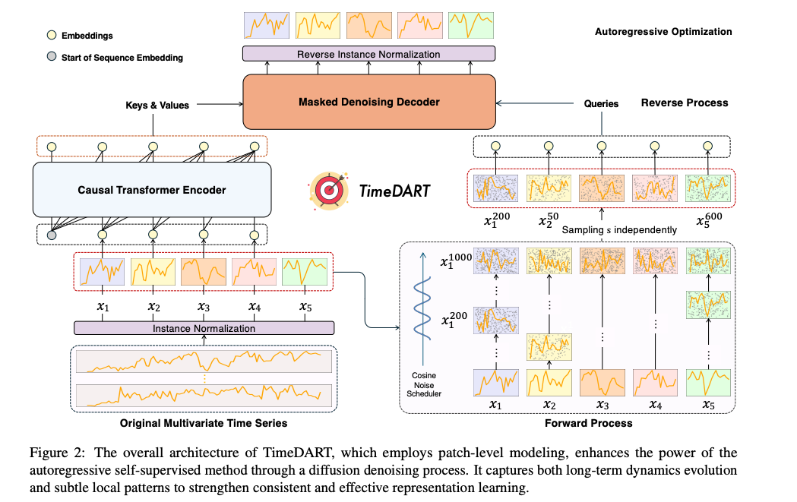

## 时间序列补全
在科研层面，时间序列 imputation 是一个很好的交叉研究切入点，因为它涉及：

1. **概率建模**： 
    - 建模数据生成机制（MCAR/MAR/MNAR）、缺失模式（点缺失/块缺失/结构化缺失），与生成模型（GAN、VAE、Diffusion）结合。

2. **时间序列建模**： 
    - 探索 Transformer、ODE-based 模型、Neural CDE、时空图神经网络等新架构在不规则采样和缺失补全中的表现。

3. **不确定性估计**： 
    - 输出的不仅是点预测，还能给出补全值的置信区间（Bayesian / Ensemble 方法）。

4. **因果推断与数据机制理解**： 
    - 利用缺失模式反推数据生成机理（如设备运行规律、异常触发模式）。

5. **多任务联合学习**： 
    - 将 Imputation 与预测、分类、检测等任务联合训练，提升整体性能（Self-supervised / Multi-task learning）。

6. **benchmark 建设与评估方法**： 
    - 构建标准化缺失模拟方法、评估指标体系（RMSE、MAE、CRPS 等），推动可复现研究。

## 缺失数据机制理论

在缺失数据研究中，Rubin（1976）提出的三大缺失机制是基础理论框架，广泛应用于统计学、机器学习和时间序列分析任务中：

 **观测值 $$X_{obs}$$**： 指在数据集中真实收集到的、非缺失的部分；
 **未观测值 $$X_{mis}$$**：原本应该存在但未被记录的部分（即缺失值）。

 ### 例如：完整数据矩阵 \(X\)

假设原本有一个完整的时间序列或数据表：

$$
X = \{x_{ij}\}, \quad i=1,\dots,n, \ j=1,\dots,p
$$

其中：
- \(i\) 表示第 \(i\) 条记录（如时间点、样本）
- \(j\) 表示第 \(j\) 个特征（如传感器、变量）

如果没有缺失，所有 $$\(x_{ij}\)$$ 都是已知的。  
但在现实中，会有一些 $$\(x_{ij}\)$$ 缺失，可以用**缺失指示矩阵** $$\(M\)$$ 标记：

$$
M_{ij} =
\begin{cases}
1, & x_{ij} \ \text{缺失} \\
0, & x_{ij} \ \text{已观测}
\end{cases}
$$

1. **完全随机缺失（Missing Completely At Random, MCAR）**  
   缺失的发生与观测值或未观测值无关，即缺失数据在总体中是随机分布的。  
   - **数学表达**：  
     $$P(M \mid X_{obs}, X_{mis}) = P(M)$$  
     其中 \( M \) 表示缺失指示矩阵，$$\(X_{obs}\)$$ 表示已观测值，$$\(X_{mis}\)$$ 表示缺失值。
   - **示例**：传感器偶发网络掉线导致的测量丢失；计划停电导致数据缺失（由于外部、预先安排好的事件引起，和数据本身的真实值无关）
   - **插补方法适用性**：均值插补、KNN插补、随机森林插补等传统方法效果良好。
   - 多见于 点缺失、随机小块缺失。

2. **随机缺失（Missing At Random, MAR）**  
   缺失的发生与已观测变量有关，但与缺失值本身无关。  
   - **数学表达**：  
     $$P(M \mid X_{obs}, X_{mis}) = P(M \mid X_{obs})$$
   - **示例**：医院在患者**病情**较轻时不测量某些指标，但具体缺失与该指标真实值无直接关系；调查中年轻人更愿意回答收入问题，而年长者更可能拒答。这里缺失概率依赖于“年龄”（已观测变量），但不依赖于未回答的收入值本身。
   - **插补方法适用性**：多重插补（MICE）、条件生成模型、变分自编码器等。
   - 多见于 条件性块缺失、部分 结构化缺失。

3. **非随机缺失（Missing Not At Random, MNAR）**  
   缺失的发生与缺失值本身有关，即缺失机制依赖于未观测的真实值。  
   - **数学表达**：  
     $$P(M \mid X_{obs}, X_{mis}) \neq P(M \mid X_{obs})$$
   - **示例**：患者病情严重时某项指标异常，医生选择不测量或测量失败；高收入者因为隐私担忧故意不回答收入问题。缺失概率依赖于未回答的收入（真实值）本身，即收入越高越可能缺失，控制年龄等变量也解释不了。
   - **插补方法适用性**：需要机制建模（例如联合建模法、选择模型、模式混合模型）。
   - 多见于 大块连续缺失、变量级缺失、部分 结构化缺失。

**MAR**：当前变量的缺失概率依赖于其他已观测变量，但与自身未观测值无关。 
**MNAR**：当前变量的缺失概率依赖于自身的未观测真实值，即使控制了所有已观测变量后这种依赖仍然存在。

> **2025年研究进展**  
> 近年来，针对复杂应用（尤其是时间序列和多模态场景），研究者提出了**混合缺失机制（Hybrid Missingness）**、**因果驱动缺失（Causal Missingness）**等新概念，强调缺失机制可能在同一数据集内混合存在，并与外部因果关系相关。这一趋势推动了**机制感知（Mechanism-aware）Imputation**方法的发展。

## 常用时序 Imputation 数据集与缺失机制分析

| 领域         | 典型数据集                           | 主要缺失机制               | 备注                               |
| ------------ | ------------------------------------ | -------------------------- | ---------------------------------- |
| 电力能源     | Electricity, ETT, Solar              | MCAR、MAR                  | 主要为随机丢失                     |
| 交通         | PeMS, METR-LA                        | MAR、IRM、少量AM           | 具时空相关，缺失较复杂              |
| 空气质量     | BeijingAir, ItalyAir                 | MCAR、MAR、部分AM          | 极端环境下缺失机制复杂              |
| 医疗健康     | PhysioNet 2012/2019                   | MNAR                       | 与病情相关，非随机缺失              |
| 船舶/金融等  | Vessel AIS, Exchange Rate            | AM、PO、MCAR               | 包含设备异常与计划停机缺失          |

---

## 缺失机制 (Mechanism) 与 缺失模式 (Pattern) 的关系

| 缺失机制 | 含义 | 常见缺失模式 | 解释 |
|----------|------|--------------|------|
| **MCAR** (Missing Completely at Random) | 缺失与观测值、未观测值都无关，纯随机 | **点缺失** 最常见，偶尔小块缺失 | 例如传感器偶尔随机掉一个值，或随机丢包 |
| **MAR** (Missing at Random) | 缺失概率依赖于**已观测值**，不依赖缺失值本身 | 点缺失 / 小块缺失 / 条件结构化缺失 | 例如：在高温时传感器更易失效（缺失集中在高温时间段） |
| **MNAR** (Missing Not at Random) | 缺失概率依赖于**缺失值本身**（或未观测部分） | 结构化缺失 / 大块缺失常见 | 例如：机器温度过高时停止记录（缺失的温度值本身很高） |

---
## 时间序列缺失模式（Patterns of Missingness）

| 模式类型 | 英文名称 | 描述 | 常见场景 |
|----------|----------|------|----------|
| **点缺失** | Sporadic Missing | 独立且零散的单点缺失 | 传感器偶尔漏采、网络丢包 |
| **随机小块缺失** | Random Short Block Missing | 短时间连续缺失（几步到几十步）且位置随机 | 临时信号干扰 |
| **条件性块缺失** | Conditioned Block Missing | 连续缺失受已知条件触发（MAR） | 周末停机、低电量暂停采集 |
| **大块连续缺失** | Large Continuous Block Missing | 大规模时间段连续缺失（数小时到数天） | 设备长时间故障 |
| **结构化缺失** | Structured Missing | 缺失位置有周期性或固定结构 | 采样策略（只在工作日采样） |
| **变量级缺失** | Variable-wise Missing | 某些变量长时间或永久缺失 | 某传感器损坏导致该变量全部缺失 |
| **组合型缺失** | Mixed Missing | 上述多种模式的组合 | 现实复杂系统常见 |

---
## 研究问题 (Research Question, RQ)
1. 如何设计一个统一的时间序列插补框架，能够自动识别缺失机制，并基于机制特定的数据生成过程与多模态信息进行差异化补全，同时给出置信区间估计？
## motivation

时间序列数据广泛存在于工业监控、医疗健康、金融交易、环境感知等领域。然而，在实际采集过程中，缺失值几乎不可避免，且缺失产生的机制通常与系统运行状态、外部环境及采集流程密切相关。缺失机制不仅影响数据的分布特征，还承载不同的语义信息。例如，在工业设备监控中，由计划停机导致的缺失反映系统的正常状态，此时对缺失值进行插补可能会引入错误的状态估计；而由传感器故障或通信中断造成的缺失，则需准确恢复真实状态以保证后续预测与控制的有效性。在医疗、金融等高风险领域，准确区分并处理不同缺失机制尤为关键，错误的补全可能导致灾难性后果。

然而，现有多数时间序列插补方法忽略缺失机制的多样性，直接将缺失视为普通空值，基于全局统计或模型学习的整体模式进行填充。这实际上隐含假设数据缺失为完全随机缺失（MCAR），而现实中缺失往往依赖于观测到的数据（MAR）或未观测数据（MNAR），忽视这种差异会导致插补偏差，严重影响后续分析的可靠性。

> 很多现有的时间序列插补方法，不会去分析 数据为什么缺失（即不去区分是 MCAR、MAR 还是 MNAR，也不管是传感器坏了还是计划停机），而是直接把缺失位置当作普通的空值，在整个训练数据的统计分布或模型学到的全局模式上，去“填”这些缺失点。
换句话说——它们的逻辑是：
> “不管缺失是啥原因，反正我学到的全局分布是这样的，那缺哪儿我就按整体规律补哪儿。”
> 问题在于，这种“一刀切”做法忽略了缺失背后可能存在的特殊原因。
> 如果缺失是计划停机（不该补），它依然会硬补进去，导致虚假的数据。
> 如果缺失是故障导致（需要补），但分布在故障状态下可能不同于正常状态，全局分布的补全可能会偏差很大。
> 本质上，现有方法假设缺失机制与数据值无关（相当于默认 MCAR），而现实中很多场景其实是 MAR 或 MNAR，需要更细化的处理策略。
> https://arxiv.org/pdf/2505.07180

为解决上述问题，我们提出了**机制感知的多模态时间序列插补框架（Mechanism-Aware Time Series Imputation Framework）**，该框架结合时间序列多尺度统计特征与外部多模态信息（如文本日志、气象数据、市场情绪、维护记录等），显式推断缺失机制类别（MCAR、MAR、MNAR），并为不同机制设计差异化的插补策略，实现更精准和可解释的补全。

此外，我们引入动态权重机制，平衡时间序列内部特征与外部多模态信息的影响，且支持补全结果的不确定性估计，为高风险决策场景提供置信区间支持，提升安全性和可信度。

---

## 核心数学建模公式

设多模态时间序列数据为 $$\(X = \{X^{(m)}\}_{m=1}^M\)$$，观测部分为 $$\(X_{obs}\)$$，缺失部分为 $$\(X_{mis}\)$$，缺失掩码为 \(M\)。

1. **缺失机制分类模型**  
通过时间序列数据和外部多模态信息 \(Z\)，推断缺失机制类别 \(C \in \{MCAR, MAR, MNAR\}\)：  
$$P(C \mid X_{obs}, Z) = \text{Classifier}_\theta(X_{obs}, Z)$$

2. **条件插补模型**  
根据缺失机制类别，选择对应的插补函数：  
$$\hat{X}_{mis} = f_{\phi_C}(X_{obs}, Z), \quad C \in \{MCAR, MAR, MNAR\}$$

3. **联合优化目标**  
端到端训练缺失机制分类与插补模块：  
$$\min_{\theta, \phi} \mathbb{E}_{X, M, C} \left[ \mathcal{L}_{imp}(X_{mis}, \hat{X}_{mis}) + \lambda \mathcal{L}_{cls}(C, \hat{C}) \right]$$  
其中，\(\mathcal{L}_{imp}\) 表示插补误差，\(\mathcal{L}_{cls}\) 为缺失机制分类损失，\(\lambda\) 是权重超参数。

4. **不确定性估计**  
通过贝叶斯或深度集成方法，为插补结果提供置信区间：  
$$P(\hat{X}_{mis} \mid X_{obs}, Z, C) \approx \mathcal{N}(\mu_{\phi_C}, \sigma_{\phi_C}^2)$$

---

## 贡献总结

- 首次提出机制感知的多模态时间序列插补框架，统一应对MCAR、MAR、MNAR三种缺失机制；  
- 结合多模态信息与时间序列多尺度特征，实现缺失机制推断与差异化插补策略；  
- 支持补全不确定性估计，提升高风险领域决策的安全性和可解释性。

---

# 参考论文列表

1. **TimeDART: A Diffusion Autoregressive Transformer for Self-Supervised Time Series Representation**  
   - 链接: [https://icml.cc/virtual/2025/poster/43701](https://icml.cc/virtual/2025/poster/43701)  
   - 作者: Daoyu Wang, Mingyue Cheng, Zhiding Liu, Qi Liu  
   - 关键词: 预测，自回归，自监督
   - **Abstract**: Self-supervised learning has garnered increasing attention in time series analysis for benefiting various downstream tasks and reducing reliance on labeled data. Despite its effectiveness, existing methods often struggle to comprehensively capture both long-term dynamic evolution and subtle local patterns in a unified manner. In this work, we propose TimeDART, a novel self-supervised time series pre-training framework that unifies two powerful generative paradigms to learn more transferable representations. Specifically, we first employ a causal Transformer encoder, accompanied by a patch-based embedding strategy, to model the evolving trends from left to right. Building on this global modeling, we further introduce a denoising diffusion process to capture fine-grained local patterns through forward diffusion and reverse denoising. Finally, we optimize the model in an autoregressive manner. As a result, TimeDART effectively accounts for both global and local sequence features in a coherent way. We conduct extensive experiments on public datasets for time series forecasting and classification. The experimental results demonstrate that TimeDART consistently outperforms previous compared methods, validating the effectiveness of our approach. Our code is available at https://github.com/Melmaphother/TimeDART.
   - **动机**：当前自监督时间序列学习方法在捕捉长程动态与局部细节方面存在挑战：（1）基于自动回归（autoregressive）的方法虽符合时序自然趋势，但容易过拟合噪声、异常值；（2）扩散（diffusion）模型擅长恢复细节，但弱化全局依赖性。理想的自监督方法应同时兼具全局趋势建模和细粒度特征提取，以提升下游任务性能 。
   - **方法简述（Proposed Method）**：
    - 自回归 Transformer 编码器（causal Transformer）：采用 patch 级别嵌入与因果遮掩，捕捉序列全局动态；
    - 扩散+去噪机制：在每个 patch 中注入噪声，通过跨注意力（cross-attention）向经典 Transformer 提供修复信号，促进模型捕获局部结构；
   - **训练目标**
    - 使用扩散损失替代单纯 MSE，避免自动回归模型对高斯偏差的假设，允许对多模态分布更丰富建模 ；
    - 同时训练 autoregressive 与 diffusion 任务，以一致的特征学习目标提升表征质量。
   - **实验设置与数据集**
    - 时间序列预测（Forecasting）：PEMS（交通流量）、ETTh2, ETTm2（能源），Electricity 
    - 时间序列分类（Classification）：HAR（人体活动识别，来自可穿戴设备）、Epilepsy（癫痫发作 ECG 信号）、Sleep‑EEG（多通道 EEG 睡眠阶段分类
   

11. **LSCD: Lomb--Scargle Conditioned Diffusion for Irregular Time series Imputation**  
    - 链接: [https://icml.cc/virtual/2025/poster/45821](https://icml.cc/virtual/2025/poster/45821)  
    - 作者: Elizabeth M Fons Etcheverry, Alejandro Sztrajman, Yousef El-Laham, Luciana Ferrer, Svitlana Vyetrenko, Manuela Veloso  
    - 关键词: 插补，不规则时间序列，扩散

12. **VerbalTS: Generating Time Series from Texts**  
    - 链接: [https://icml.cc/virtual/2025/poster/45631](https://icml.cc/virtual/2025/poster/45631)