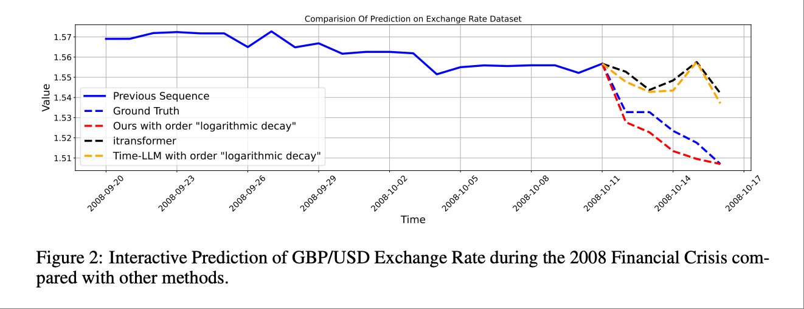
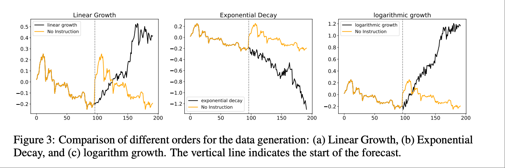
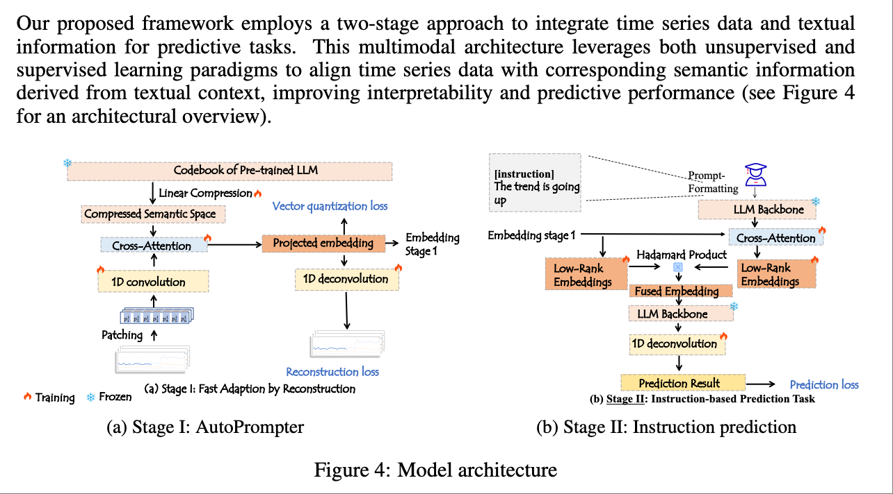
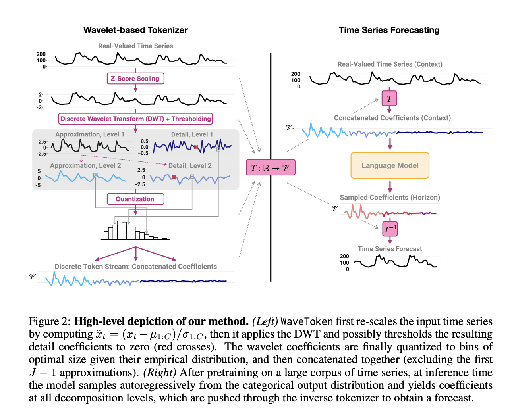
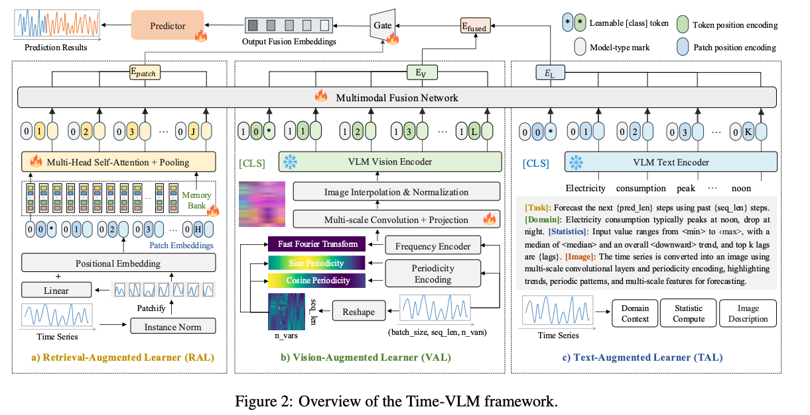

# 多模态时序分析

## Motivation
1. 随着深度学习兴起，长短期记忆网络（LSTM）和卷积神经网络（CNN）等模型在建模这些复杂性方面取得了显著提升。然而，它们仍受限于仅依赖数值数据，无法融合外部情境信息——例如**专家见解**或**宏观经济**事件——而这些信息本可提高预测的准确率与可解释性。在金融、病患监护等混沌或高波动的系统中，这一缺陷尤为突出。
近年来，基于 **Transformer** 的架构以及**大语言模型(LLM)**的发展增强了捕获时间序列长程依赖的能力。但单独使用这些模型时，它们往往错失其他模态（如文本）所能提供的关键领域知识。在实际场景中，领域专家可能希望给出指令或洞见以引导预测过程，而现有模型难以灵活接纳此类交互。  

2. 传统时序预测普遍假设未来延续历史趋势与周期，强调被动预测——即回答“未来会怎样”。然而在气象、能源、金融等领域，分析师常需要主动塑形未来：注入经验或突发信息，调整曲线形态、引入特定事件或改变局部波动，以模拟不同情景，这超出了传统预测的范畴。现有文本辅助方法虽然允许自然语言输入，但多将其作为静态特征简单融合，缺乏两项核心能力：**（1）时间感知的动态权衡**，无法在不同时间段平衡历史模式与指令意图，既可人工调节权重，也可由模型自动调整；**（2）语义–时间的精细对齐**，难以将文本描述的趋势、事件和幅度精确映射到预测曲线上；通过多尺度语义–时间建模，将文本中全局趋势与局部事件映射到不同时间尺度，同时结合历史时序的统计特性与信号分解结果，实现文本语义与未来曲线的精细对齐，保证编辑结果的物理合理性和可解释性。**此外**，这些方法几乎不提供文本干预下的概率置信区间，使分析师难以评估指令影响与风险。为此，我们提出文本驱动的可控时序编辑框架，通过动态加权、语义–时间对齐及不确定性生成，使模型在保留历史规律的同时，能够根据自然语言指令主动“编辑”未来走势，并量化干预影响，实现从被动预测到可控生成与未来塑形的范式转变。

---

## 论文列表
1. **Instruction-Following LLMs for Time Series Prediction: A Two-Stage Multimodal Approach**
    - **链接**: https://openreview.net/forum?id=01wMplF8TL
    - **作者**: Anonymous authors (Paper under double-blind review)
    - **关键词**: Time series prediction, LLMs, multimodal, instruction-following, text integration
    - **abstract**: We introduce Text-Informed Time Series Prediction (TITSP), an innovative multimodal framework that integrates textual knowledge with temporal dynamics using Large Language Models (LLMs). TITSP employs a two-stage process that bridges numerical data with rich contextual information for enhanced forecasting accuracy and interpretability. In the first stage, we present AutoPrompter, which captures temporal dependencies from time series data and aligns them with semantically meaningful text embeddings. In the second stage, these aligned embeddings are refined by incorporating task-specific textual instructions through LLM. We evaluate TITSP on several multimodal time series prediction tasks, demonstrating substantial improvements over state-of-the-art baselines. Quantitative results reveal significant gains in predictive performance, while qualitative analyses show that textual context enhances interpretability and actionable insights. Our findings indicate that integrating multimodal inputs not only improves prediction accuracy but also fosters more intuitive, user-centered forecasting.
    - **动机**：时序预测在金融、医疗和气候科学等领域至关重要，用于支持决策。传统方法如ARIMA难以处理复杂的非线性模式和长距离依赖，而深度学习模型如LSTM和CNN虽有所改进，但仅依赖数值数据，限制了外部上下文信息（如专家见解或宏观经济事件）的整合。这在波动性强的系统中（如金融市场或患者健康监测）尤为问题。Transformer基模型和LLM的最新进展提升了依赖捕捉，但缺乏与领域特定文本见解的整合。TITSP通过结合深度学习处理时序与LLM整合文本输入，解决这些挑战，实现更准确、上下文感知且可解释的预测，尤其在需要专家输入的场景中。
    - **方法简述（Proposed Method）**：提出的方法Text-Informed Time Series Prediction (TITSP)  
        - 第一阶段，(Stage 1: AutoPrompter) 的工作机制：AutoPrompter 是 TITSP 框架的第一阶段，其核心目标是将时序数据转换为压缩的、语义丰富的文本嵌入空间。通过修改后的 Vector Quantized-Variational AutoEncoder (VQ-VAE) 结合交叉注意力机制和预训练语言码本，实现时序嵌入与文本嵌入的对齐，从而捕捉潜在的语义模式，为后续文本上下文整合奠定基础。该阶段采用自监督学习方式训练，强调时序数据的语义表示学习，而非直接预测。
        - 第二阶段，(Stage 2: Supervised Multimodal Fusion for Prediction) 的工作机制第二阶段通过整合任务特定文本指令（如“趋势上升”）来精炼第一阶段的嵌入，利用大型语言模型 (LLM) 进行监督时序预测。该阶段强调条件预测，提升准确性和可解释性，采用监督学习方式，焦点在于多模态融合和最终预测生成。

    - **实验设置与数据集**：使用的数据集包括ETTh1、ETTh2、ETTm1、ETTm2、天气、交通、电力、汇率，以及Lorenz时序，使用合成数据生成并融入文本指令如“增加”、“减少”或“稳定”。评估指标为均方误差 (MSE)、平均绝对误差 (MAE) 和遵守率（预测遵守指令的比例）。比较的基线包括Time-LLM、Qwen4MTS、UniTime、Llama-3.1-8B、GPT4MTS、itransformer和PatchTST。主要结果显示TITSP性能优越，具有高遵守率（如“保持稳定”为0.98）和低MSE（如“保持稳定”为0.35），比基线更好，证明了强大的零样本泛化和关键词提取能力，尤其在处理长序列和指令遵守方面。
    - **审稿人对论文的弱点评价**：
        - 创新性（普遍认可）：所有 reviewer 都肯定“把文本指令引入时间序列预测”这一思路本身有价值，认为把 LLM 当作可插拔的第二阶段来融合专家知识具有启发性。
        - 方法细节与可复现性（最大争议点）： R1 & R3 指出论文对 AutoPrompter 如何把数值序列映射为“语义有意义的文本嵌入”描述不足，缺少关键公式和消融实验；R2 提到代码与数据没有完全公开，只靠文字描述难以复现；R4 认为第二阶段的 LLM prompt 设计过于简单，担心对指令措辞敏感，建议给出 prompt 模板与消融。
        - 实验充分性（褒贬不一）：R2 & R4 质疑数据规模偏小（最大仅 50 k 点），且全部来自金融/能源领域，担心跨领域泛化能力；R3 建议增加 ablation：去掉文本、只用 LLM 等设置，以明确增益来源。
        - 可解释性与用户体验（亮点）：多位 reviewer 喜欢论文提供的“自然语言解释”示例，认为对业务人员友好；R1 建议把更多案例放进正文而不是附录。
    
    
    

4. **Enhancing Foundation Models for Time Series Forecasting via Wavelet-based Tokenization**  
   - **链接**: [https://icml.cc/virtual/2025/poster/46131](https://icml.cc/virtual/2025/poster/46131)  
   - **作者**: Luca Masserano, Abdul Fatir Ansari, Boran Han, Xiyuan Zhang, Christos Faloutsos, Michael Mahoney, Andrew Wilson, Youngsuk Park, Syama Sundar Yadav Rangapuram, Danielle Maddix, Yuyang Wang 论文由 Cornell University 和 多个工业团队（包括 AWS AI、Google Research、Stanford 等）合作完成 
   - **关键词**: 预测，基础模型，小波变换，token化
   - **Abstract**: How to best develop foundational models for time series forecasting remains an important open question. Tokenization is a crucial consideration in this effort: what is an effective discrete vocabulary for a real-valued sequential input? To address this question, we develop WaveToken, a wavelet-based tokenizer that allows models to learn complex representations directly in the space of time-localized frequencies. Our method first scales and decomposes the input time series, then thresholds and quantizes the wavelet coefficients, and finally pre-trains an autoregressive model to forecast coefficients for the forecast horizon. By decomposing coarse and fine structures in the inputs, wavelets provide an eloquent and compact language for time series forecasting that simplifies learning. Empirical results on a comprehensive benchmark, including 42 datasets for both in-domain and zeroshot settings, show that WaveToken: i) provides better accuracy than recently proposed foundation models for forecasting while using a much smaller vocabulary (1024 tokens), and performs on par or better than modern deep learning models trained specifically on each dataset; and ii) exhibits superior generalization capabilities, achieving the best average rank across all datasets for three complementary metrics. In addition, we show that our method can easily capture complex temporal patterns of practical relevance that are challenging for other recent pre-trained models, including trends, sparse spikes, and non-stationary time series with varying frequencies evolving over time.
   - **动机**：在构建 时间序列基础模型（foundation models） 时，关键挑战之一是如何将连续时间信号有效离散成可学习的 token。作者指出，现有 tokenization 方法往往要么过度依赖粗粒度采样、导致信息丢失；要么词表过大、难以训练和泛化。
   - **方法简述（Proposed Method）**：
    - 提出 WaveToken——一种基于小波变换的 tokenization 技术：将原始时序按不同时频尺度分解，量化阈值后形成有限词汇表（如 1024 tokens）；然后预训练自回归模型去预测未来小波系数，从而在频域结构上学习时间序列特征。该方法既保持了时频信息，又显著减少词表复杂度和显存占用。
   - **实验设置与数据集**
    - WaveToken 在包含 42（Electricity、Traffic（PEMS）、ETT、ETTm ） 个数据集的全面 benchmark 上评测，覆盖 in-domain 和 zero-shot 场景，结果显示其在多个常用任务中超越或匹配现有基础模型和针对性深度模型，并在泛化能力上表现优异。
   

5. **Time-VLM: Exploring Multimodal Vision-Language Models for Augmented Time Series Forecasting**  
   - **链接**: [https://icml.cc/virtual/2025/poster/44762](https://icml.cc/virtual/2025/poster/44762)  
   - **作者**: Siru Zhong, Weilin Ruan, Ming Jin, Huan Li, Qingsong Wen, Yuxuan Liang  
   - **关键词**: 预测，多模态，视觉语言模型
   - **Abstract**: Recent advancements in time series forecasting have explored augmenting models with text or vision modalities to improve accuracy. While text provides contextual understanding, it often lacks fine-grained temporal details. Conversely, vision captures intricate temporal patterns but lacks semantic context, limiting the complementary potential of these modalities.（虽然文本可以提供上下文理解，但它通常缺乏细粒度的时间细节。相反，视觉能够捕捉复杂的时间模式，但缺乏语义背景，从而限制了这两种模态的互补潜力。） To address this, we propose Time-VLM, a novel multimodal framework that leverages pre-trained Vision-Language Models (VLMs) to bridge temporal, visual, and textual modalities for enhanced forecasting. Our framework comprises three key components: (1) a Retrieval-Augmented Learner, which extracts enriched temporal features through memory bank interactions; (2) a Vision-Augmented Learner, which encodes time series as informative images; and (3) a Text-Augmented Learner, which generates contextual textual descriptions. These components collaborate with frozen pretrained VLMs to produce multimodal embeddings, which are then fused with temporal features for final prediction. Extensive experiments demonstrate that Time-VLM achieves superior performance, particularly in few-shot and zeroshot scenarios, thereby establishing a new direction for multimodal time series forecasting. Code is available at https://github.com/CityMind-Lab/ICML25-TimeVLM.
   - **动机**：时间序列预测在金融、气象、能源等领域具有重要应用。虽然已有模型尝试引入文本或视觉信息增强预测性能，但单一模态的方法仍存在语义理解不足或缺乏时序结构等局限。当前缺乏一个能同时整合文本、图像和时间序列数据的统一模型。因此，作者提出探索如何利用预训练视觉-语言模型（VLMs），统一三种模态信息，从而提升在数据稀缺场景下的预测性能与泛化能力。
   - **方法简述（Proposed Method）**：作者提出了Time-VLM，这是一个新颖的多模态预测框架，包含三个模块：（1）Retrieval-Augmented Learner (RAL) 用于从时间序列中提取丰富的时序特征；（2）Vision-Augmented Learner (VAL) 将时间序列转换为图像，以捕捉时空结构特征；（3）Text-Augmented Learner (TAL) 生成与时间序列相关的上下文语义文本。三个模块的输出通过**冻结的预训练VLM（如ViLT、CLIP）**进行融合，再输入至预测器生成最终预测结果。该框架无需外部图像或文本数据，能自行生成辅助模态以增强自身预测。
   - **实验设置与数据集**：
    作者在多个时间序列数据集上进行了实验，涵盖能源（ETTh1, ETTh2, ETTm1, ETTm2）、气象（Weather）、电力（ECL）、交通（Traffic）以及短期预测基准数据集M4，评估包括全监督、少样本（few-shot）与零样本（zero-shot）等场景。Time-VLM在多个指标（如MSE、MAE、SMAPE等）上均显著优于现有SOTA模型，尤其在数据稀缺条件下展现出强大的泛化能力。
   

