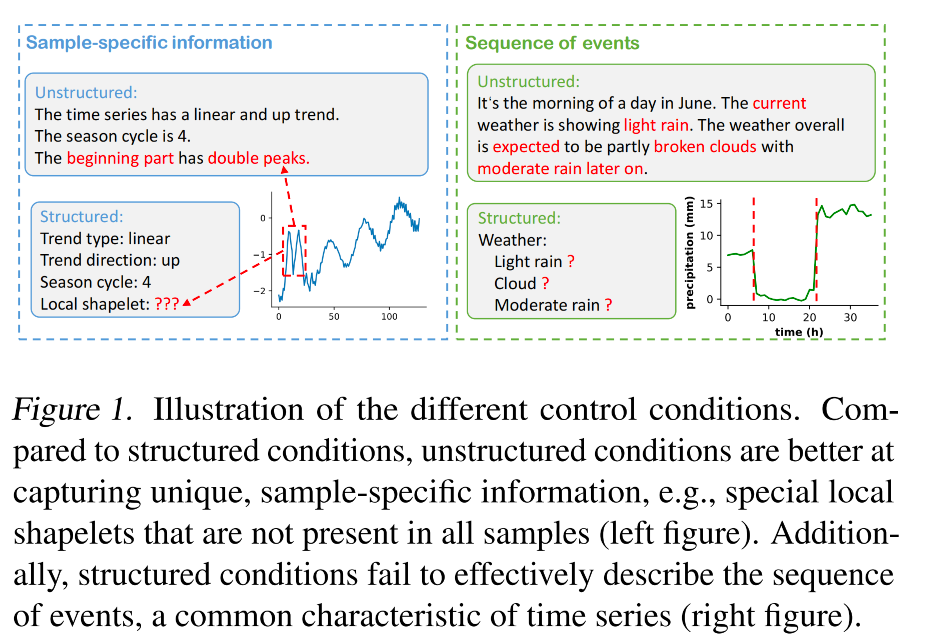
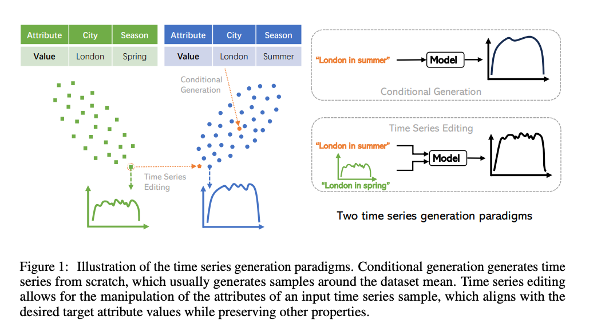
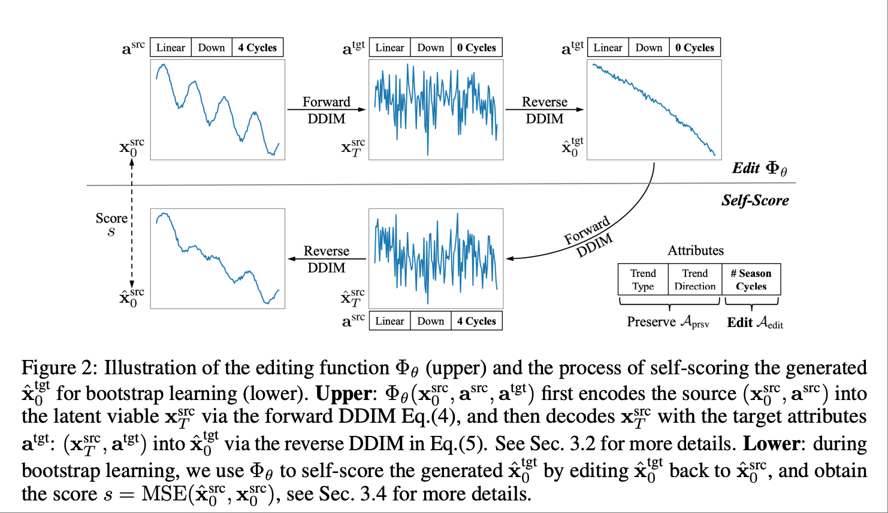
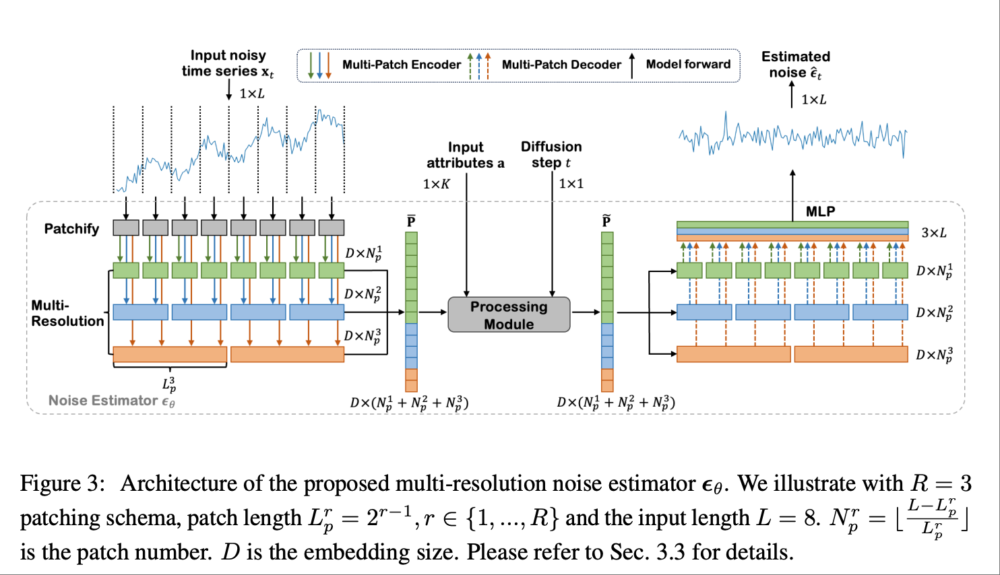
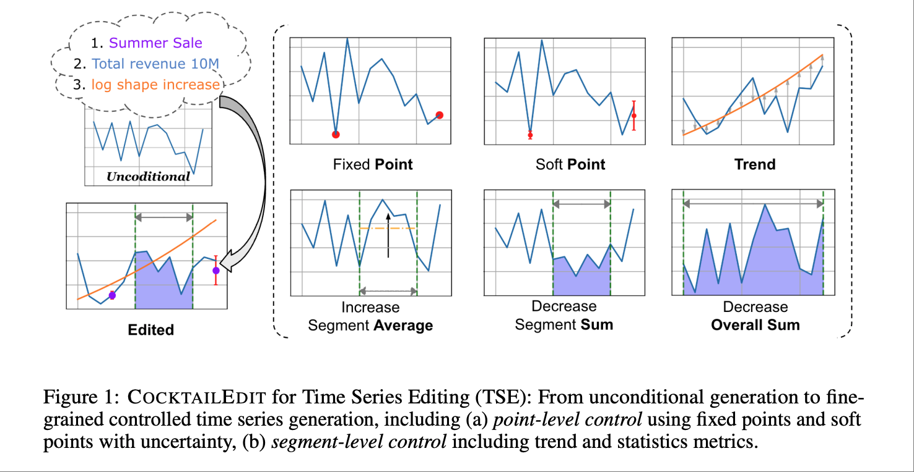
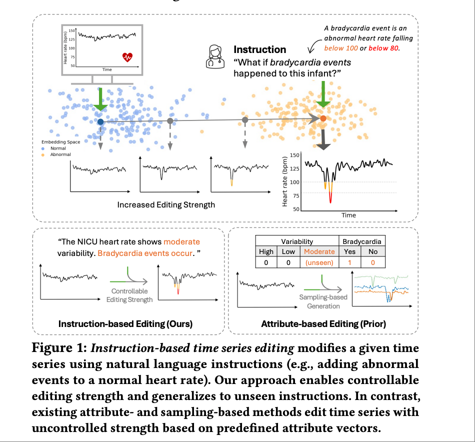
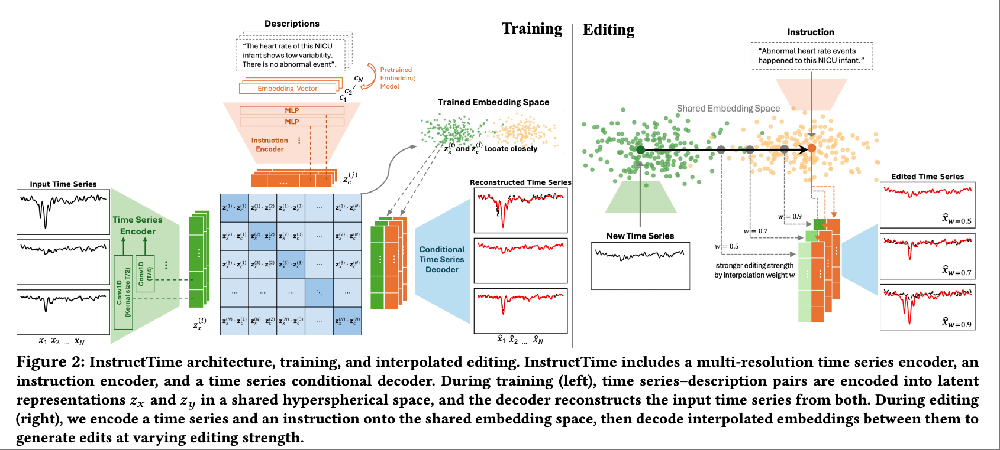

# 多模态时序分析：**从”预测“走向“可控生成”**

## Motivation
1. 随着深度学习兴起，长短期记忆网络（LSTM）和卷积神经网络（CNN）等模型在建模这些复杂性方面取得了显著提升。然而，它们仍受限于仅依赖数值数据，无法融合外部情境信息——例如**专家见解**或**宏观经济**事件——而这些信息本可提高预测的准确率与可解释性。在金融、病患监护等混沌或高波动的系统中，这一缺陷尤为突出。
近年来，基于 **Transformer** 的架构以及**大语言模型(LLM)**的发展增强了捕获时间序列长程依赖的能力。但单独使用这些模型时，它们往往错失其他模态（如文本）所能提供的关键领域知识。在实际场景中，领域专家可能希望给出指令或洞见以引导预测过程，而现有模型难以灵活接纳此类交互。  

2. 传统时序预测普遍假设未来延续历史趋势与周期，强调被动预测——即回答“未来会怎样”。然而在气象、能源、金融等领域，分析师常需要主动塑形未来：**注入经验或突发信息，调整曲线形态、引入特定事件或改变局部波动，以模拟不同情景**，这超出了传统预测的范畴。现有文本辅助方法虽然允许自然语言输入，但多将其作为静态特征简单融合，缺乏两项核心能力：**（1）时间感知的动态权衡**，无法在不同时间段平衡历史模式与指令意图，既可人工调节权重，也可由模型自动调整；**（2）语义–时间的精细对齐**，难以将文本描述的趋势、事件和幅度精确映射到预测曲线上；通过多尺度语义–时间建模，将文本中全局趋势与局部事件映射到不同时间尺度，同时结合历史时序的统计特性与信号分解结果，实现文本语义与未来曲线的精细对齐，保证编辑结果的物理合理性和可解释性。**此外**，这些方法几乎不提供文本干预下的概率置信区间，使分析师难以评估指令影响与风险。为此，我们提出文本驱动的可控时序编辑框架，通过动态加权、语义–时间对齐及不确定性生成，使模型在保留历史规律的同时，能够根据自然语言指令主动“编辑”未来走势，并量化干预影响，实现从被动预测到可控生成与未来塑形的范式转变。

3. 在现实世界的时序预测任务中，研究者往往不仅需要被动地回答“未来会怎样”，还需要根据领域知识、突发事件或特定目标**主动塑形未来**，例如模拟政策干预后的经济走势，或基于运维策略调整能源系统的负荷曲线。现有自回归预测方法通常在局部时间窗口（look-back window）内，通过建模短期依赖来生成未来序列，但缺乏将人类高层语义意图直接融入预测过程的能力，因而难以支持**基于自然语言指令的时序编辑**。
    
    为此，我们提出一种**多层次动作描述驱动的可控时序生成范式**：首先，将连续的时间步（如 3–5 个点的预测区间）视为一个 token，并在真实数据上打上文本化的局部动作标签（local action description），这些标签通过预定义的规则或领域基准刻画局部动态模式（如“缓慢上升”“周期回落”）。在此基础上，训练一个自回归模型，使其能够根据局部文本动作指令预测下一个时序 token，实现可解释的短期生成。  
然而，单纯的局部生成难以捕捉长周期趋势、全局约束及领域知识。因此，我们进一步引入**全局动作描述（global action description）**，用于刻画长期模式及各种约束，包括：
    1. **物理约束**：如设备安全阈值、电力负荷或温度上下界，保证生成序列符合物理可能性；  
    2. **统计约束**：如均值、方差或波动范围，确保序列整体分布合理；  
    3. **领域逻辑规则**：如业务规则、操作限制或调度约束，使生成序列在业务场景中可行。  
    全局描述与局部动作指令联合作用，使模型能够在生成过程中同时满足局部可控性和全局一致性。例如，用户可以通过自然语言指令“保持当前震荡频率，但将幅度降低 20%”主动编辑未来曲线，同时确保序列不会超过安全阈值或违背领域规则。  
这一范式的核心创新性在于：
    - **从被动预测到主动编辑**：模型支持通过自然语言直接干预未来轨迹；  
    - **多尺度语义融合**：局部动作与全局约束联合建模，实现短期灵活性与长期一致性平衡；  
    - **跨模态可控生成**：自然语言作为控制信号嵌入时序预测，赋予模型可解释性与交互性。  
    这种方法为交互式时序预测和假设情景模拟提供了新的范式，使模型不仅能回答“未来会怎样”，还能基于高层语义主动塑形未来轨迹。

4. 非结构化文本生成时间序列的挑战：
    - 非结构化数据的语义复杂性：文本等非结构化数据包含错综复杂的语义信息，难以区分相关内容与无关噪声，导致模型容易受干扰。
    - 时间序列的独特特性：时间序列具有多变量特性和复杂时序依赖，与图像生成中的空间结构根本不同，无法直接移植图像方法。
    - 控制条件的多语义影响：生成条件包含多层语义，并施加不同影响（如“整天下雨” vs. “晴天后下雨”的细微区别），需准确反映在序列中。
    - 配对数据的稀缺：现实中缺少文本-时间序列配对数据，阻碍两种模态间鲁棒连接的学习。

5. 自回归时间序列建模的一个根本问题在于其普遍对序列中所有 token 一视同仁，即默认每个时间步对学习目标的贡献是均等的。现实数据却往往并非如此：大部分 token 仅反映平滑延续的常态模式，而真正影响预测与决策的，往往是极少数**承载不成比例预测价值的关键片段**，例如趋势突变、结构性断点、极值尖峰或剧烈波动。忽视这种异质性不仅导致模型在容量分配上低效，还会造成对关键时刻学习不足，进而在分布偏移场景下表现出脆弱的泛化能力。为此，我们主张重新审视时间序列的学习目标：在训练过程中显式引入 token 重要性建模，自适应地强调序列中承载结构性信号的时刻。具体而言，可以沿三条技术路线实施：(i) 显著性感知的损失设计，利用统计检验（如变点检测、波动率估计）、信号处理先验或可学习的注意力机制确定 token 权重；(ii) 课程式优化策略，通过逐步调整训练重心，引导模型向高重要性片段聚焦；(iii) 不确定性融合，在关键转折点上动态校准预测置信度。该框架突破了传统“均值驱动”的似然最大化范式，建立了一种重要性驱动的自回归建模思路，能够在最关键之处优先学习，从而实现更高效、更稳健的预测能力，对金融风险预警、能源调度和异常检测等高敏感应用场景具有重要意义。

---

## 论文列表
1. **Instruction-Following LLMs for Time Series Prediction: A Two-Stage Multimodal Approach**
    - **链接**: https://openreview.net/forum?id=01wMplF8TL
    - **作者**: Anonymous authors (Paper under double-blind review)
    - **关键词**: Time series prediction, LLMs, multimodal, instruction-following, text integration
    - **abstract**: We introduce Text-Informed Time Series Prediction (TITSP), an innovative multimodal framework that integrates textual knowledge with temporal dynamics using Large Language Models (LLMs). TITSP employs a two-stage process that bridges numerical data with rich contextual information for enhanced forecasting accuracy and interpretability. In the first stage, we present AutoPrompter, which captures temporal dependencies from time series data and aligns them with semantically meaningful text embeddings. In the second stage, these aligned embeddings are refined by incorporating task-specific textual instructions through LLM. We evaluate TITSP on several multimodal time series prediction tasks, demonstrating substantial improvements over state-of-the-art baselines. Quantitative results reveal significant gains in predictive performance, while qualitative analyses show that textual context enhances interpretability and actionable insights. Our findings indicate that integrating multimodal inputs not only improves prediction accuracy but also fosters more intuitive, user-centered forecasting.
    - **动机**：时序预测在金融、医疗和气候科学等领域至关重要，用于支持决策。传统方法如ARIMA难以处理复杂的非线性模式和长距离依赖，而深度学习模型如LSTM和CNN虽有所改进，但仅依赖数值数据，限制了外部上下文信息（如专家见解或宏观经济事件）的整合。这在波动性强的系统中（如金融市场或患者健康监测）尤为问题。Transformer基模型和LLM的最新进展提升了依赖捕捉，但缺乏与领域特定文本见解的整合。TITSP通过结合深度学习处理时序与LLM整合文本输入，解决这些挑战，实现更准确、上下文感知且可解释的预测，尤其在需要专家输入的场景中。
    - **方法简述（Proposed Method）**：提出的方法Text-Informed Time Series Prediction (TITSP)  
        - 第一阶段，(Stage 1: AutoPrompter) 的工作机制：AutoPrompter 是 TITSP 框架的第一阶段，其核心目标是将时序数据转换为压缩的、语义丰富的文本嵌入空间。通过修改后的 Vector Quantized-Variational AutoEncoder (VQ-VAE) 结合交叉注意力机制和预训练语言码本，实现时序嵌入与文本嵌入的对齐，从而捕捉潜在的语义模式，为后续文本上下文整合奠定基础。该阶段采用自监督学习方式训练，强调时序数据的语义表示学习，而非直接预测。
        - 第二阶段，(Stage 2: Supervised Multimodal Fusion for Prediction) 的工作机制第二阶段通过整合任务特定文本指令（如“趋势上升”）来精炼第一阶段的嵌入，利用大型语言模型 (LLM) 进行监督时序预测。该阶段强调条件预测，提升准确性和可解释性，采用监督学习方式，焦点在于多模态融合和最终预测生成。

    - **实验设置与数据集**：使用的数据集包括ETTh1、ETTh2、ETTm1、ETTm2、天气、交通、电力、汇率，以及Lorenz时序，使用合成数据生成并融入文本指令如“增加”、“减少”或“稳定”。评估指标为均方误差 (MSE)、平均绝对误差 (MAE) 和遵守率（预测遵守指令的比例）。比较的基线包括Time-LLM、Qwen4MTS、UniTime、Llama-3.1-8B、GPT4MTS、itransformer和PatchTST。主要结果显示TITSP性能优越，具有高遵守率（如“保持稳定”为0.98）和低MSE（如“保持稳定”为0.35），比基线更好，证明了强大的零样本泛化和关键词提取能力，尤其在处理长序列和指令遵守方面。
    - **审稿人对论文的弱点评价**：
        - 创新性（普遍认可）：所有 reviewer 都肯定“把文本指令引入时间序列预测”这一思路本身有价值，认为把 LLM 当作可插拔的第二阶段来融合专家知识具有启发性。
        - 方法细节与可复现性（最大争议点）： R1 & R3 指出论文对 AutoPrompter 如何把数值序列映射为“语义有意义的文本嵌入”描述不足，缺少关键公式和消融实验；R2 提到代码与数据没有完全公开，只靠文字描述难以复现；R4 认为第二阶段的 LLM prompt 设计过于简单，担心对指令措辞敏感，建议给出 prompt 模板与消融。
        - 实验充分性（褒贬不一）：R2 & R4 质疑数据规模偏小（最大仅 50 k 点），且全部来自金融/能源领域，担心跨领域泛化能力；R3 建议增加 ablation：去掉文本、只用 LLM 等设置，以明确增益来源。
        - 可解释性与用户体验（亮点）：多位 reviewer 喜欢论文提供的“自然语言解释”示例，认为对业务人员友好；R1 建议把更多案例放进正文而不是附录。
    
    
    

    - **数据集生成**
    ### 多模态时序预测数据生成过程

    #### 概述
    在论文 *Instruction-Following LLMs for Time Series Prediction: A Two-Stage Approach (TITSP)* 中，针对真实数据集（如 ETTh1）提出了一种**自动化的多模态数据合成方法**。  
    该方法以真实时序数据为基础，自动生成文本指令，并根据指令数学地修改未来预测值，形成多模态数据对 `(时序数据 + 文本 + 修改后标签)`，以模拟结合上下文指令的预测场景，无需人工标注。

    此过程是**数据预处理步骤**，用于构建训练/评估数据集，并不直接参与模型训练。

    ---

    #### 数据生成流程

    1. **基础时序数据获取**  
       - 从真实数据集加载多变量时序序列  
        $$X = \{x_1, x_2, \ldots, x_T\}$$
         其中 $x_t$ 为时间步 $t$ 的特征向量。  
       - 以 ETTh1 为例：包含 2 年、1 小时间隔的变压器温度与 6 个电力负载特征，数据集按 12/4/4 个月划分为训练/验证/测试集。  
       - 完全自动化加载，无需人工干预。

    2. **文本指令自动生成**  
       - 为每段时序自动分配文本指令 $S$，如 `"increase"`, `"decrease"`, `"stabilize"`, `"increase amplitude"` 等（详见论文 Table 6）。  
       - 指令从预定义列表中随机采样，确保覆盖多种模式（线性、指数、对数等）。  
       - 在 ETTh1 中，每个指令可生成约 14,307 条训练样本。

    3. **基于指令的预测值修改**  
       - 按指令 $S$ 自动修改未来预测值，得到标签序列：
        $$\hat{X}(S) = \{\hat{x}(S)_{T+1}, \ldots, \hat{x}(S)_{T+H}\}$$ 其中 $H$ 为预测步长（horizon）。  
       - 修改规则基于最后观测值 $x_T$，并引入随机参数（如 $A \sim U(\cdot)$）模拟真实动态。  
       - 修改公式程序化实现（详见论文 Appendix C, Table 6）。

    4. **形成多模态数据对**  
       - 每条数据对为：  
        $$(X, S, \hat{X}(S))$$
        其中：
        - **$X$**：原始时序输入  
        - **$S$**：文本上下文  
        - **$\hat{X}(S)$**：指令修改后的标签序列  
       - 保证语义一致性，例如 `"trend up"` 对应上升趋势标签。

    ---

#### 示例

#### 示例 1
**已知**：  
- 原序列 $X = [45, 46, 47, 48, 49, 50]$  
- 指令 $S = \text{"trend up"}$  
- $A = 1$，预测步长 $H = 3$

**计算**：  

$$\hat{x}_{7} = 50 + 1 \times 1 = 51$$  

$$\hat{x}_{8} = 50 + 1 \times 2 = 52$$  

$$\hat{x}_{9} = 50 + 1 \times 3 = 53$$  

**标签**：  

$$\hat{X}(S) = [51, 52, 53]$$  

**最终数据对**：  

$([45,46,47,48,49,50], \; \text{"trend up"}, \; [51,52,53])$

---

| Action                          | Description                              | Mathematical Function                                     | Generated Dataset                              |
|---------------------------------|------------------------------------------|------------------------------------------------------------|-----------------------------------------------|
| Linear Trend Up                 | Linear increase over time                | see Equation 4                                             | weather, exchange rate                        |
| Linear Trend Down               | Linear decrease over time                | see Equation 5                                             | weather, exchange rate                        |
| Exponential Growth              | Exponential increase over time           | prediction * exp(B * np.arange(x))                         | weather, exchange rate, electricity           |
| Exponential Decay               | Exponential decrease over time           | prediction * exp(-B * np.arange(x))                        | weather, exchange rate, electricity           |
| Logarithmic Growth              | Logarithmic growth over time             | prediction + C * log(1 + np.arange(x))                     | weather, exchange rate, electricity           |
| Logarithmic Decay               | Logarithmic decay over time              | prediction - C * log(1 + np.arange(x))                     | weather, exchange rate, electricity           |
| Keep Stable                     | Constant value of last input point       | All                                                        |                                               |
| Linear Growth and Linear Decay  | Linear increase followed by decrease     | see Equation 6                                             | weather, exchange rate                        |
| Linear Decay and Linear Growth  | Linear decrease followed by increase     | see Equation 7                                             | weather, exchange rate                        |
| Increase Amplitude              | Scale up predictions by a factor         | prediction * (1 + A)                                       | ETTh1, ETTh2, ETTm1, ETTm2, traffic            |
| Decrease Amplitude              | Scale down predictions by a factor       | prediction * (1 - A)                                       | ETTh1, ETTh2, ETTm1, ETTm2, traffic            |

2. **VerbalTS: Generating Time Series from Texts**
   - **作者**: Shuqi Gu, Chuyue Li, Baoyu Jing, Kan Ren. 上海工业大学信息科学与技术学院;伊利诺伊大学厄巴纳-香槟分校
   - **关键词**: Time series generation, Text-to-time-series, Diffusion models, Multi-focal alignment, Multi-view noise estimator, Semantic reprogramming, VERBALTS
   - **Abstract**: Time series synthesis has become a foundational task in modern society, underpinning decisionmaking across various scenes. Recent approaches primarily generate time series from structured conditions, such as attribute-based metadata. However, these methods struggle to capture the full complexity of time series, as the predefined structures often fail to reflect intricate temporal dynamics or other nuanced characteristics. Moreover, constructing structured metadata requires expert knowledge, making large-scale data labeling costly and impractical. In this paper, we introduce VERBALTS, a novel framework for generating time series from unstructured textual descriptions, offering a more expressive and flexible solution to time series synthesis. To bridge the gap between unstructured text and time series data, VERBALTS employs a multi-focal alignment and generation framework, effectively modeling their complex relationships. Experiments on two synthetic and four real-world datasets demonstrate that VERBALTS outperforms existing methods in both generation quality and semantic alignment with textual conditions.
   - **相关工作**：
    - **无条件生成（unconditional generation）**：无条件生成就像“随机抽样”：模型先从真实数据中学到时间序列的整体分布（例如，通过训练捕捉数据的统计模式），然后随机生成新序列。但缺点是用户几乎无法控制生成的序列具体是什么样子（如趋势、周期或特定特征），生成的样本可能多样但不可预测或不精确。
    - **条件生成（conditional generation）**：条件生成允许用户通过“条件”来指导生成过程。这些条件是结构化的（structured），意思是固定格式、易于处理的（如键-值对或标签）。例如：元数据（metadata）：外部附加信息，如数据集标签或上下文（引用Narasimhan et al., 2024的TimeWeaver方法）；时间序列属性（attributes）：序列的内在特征，如趋势类型、季节周期（引用Jing et al., 2024a的TEdit方法）；类标签（class labels）：离散类别，用于分类指导生成（引用Li et al., 2022和Wang et al., 2023）。
    - **顺序条件**：结构化表示（如属性标签或元数据）虽然简单易用，但无法很好地处理时间序列的“顺序动态”（e.g., 事件的前后关系或时序演化）。因为结构化形式通常是静态的列表或类别，无法自然表达“顺序”（sequence），导致信息丢失。例如，一个天气序列的“先小雨后中雨”在结构化中可能只变成“Light rain, Moderate rain”，丢失了时间顺序，导致生成的序列无法准确反映真实动态。e.g.结构化： "Weather: Light rain ? Cloud ? Moderate rain ?"（无法捕捉事件顺序）；非结构化文本： "It‘s the morning of a day in June. The current weather is showing light rain. The weather overall is expected to be partly broken clouds with moderate rain later on."（明确表达顺序：当前小雨，后转为中雨）。
   - **动机**：现有时间序列生成方法主要依赖结构化条件（如元数据或属性），但这些条件难以捕捉时间序列的复杂动态（如局部形状或事件序列），且构建结构化元数据需要专家知识，导致大规模标注成本高昂且不切实际。因此，提出从非结构化文本描述生成时间序列的框架VERBALTS，提供更具表现力和灵活性的解决方案，能够更好地传达细粒度语义信息并桥接文本与时间序列间的模态差距。
        - 论文指出，结构化条件虽然易于学习和处理，但存在显著局限性，导致难以捕捉时间序列的复杂动态（如局部形状或事件序列）。主要原因如下：
            - **信息丢失（Information Loss）**：时间序列往往包含样本特定的独特信息（如特殊局部形状或不规则峰值），这些信息无法用统一的结构化框架封装。例如，论文图1中展示了“beginning part has double peaks”（开头部分有双峰），这是一种样本特定的局部形状（local shapelet），但结构化条件（如“local shapelet: ???”）难以精确描述或标准化，导致生成过程中忽略这些细微特征； 事件序列（sequence of events）是时间序列的常见特性，如天气变化的顺序（“light rain”后转为“moderate rain”），结构化条件（如简单列出“light rain, cloud, moderate rain”）无法有效捕捉时序依赖和顺序关系，容易丢失动态演化信息。
            - **预定义结构的局限性（Limitations of Predefined Structures）**：结构化条件依赖固定格式（如离散类别或数值属性），无法反映时间序列的复杂时序动态（intricate temporal dynamics）或其他细微特性（nuanced characteristics）。例如，真实世界时间序列可能涉及多变量交互、多尺度趋势或非线性变化，但结构化条件难以涵盖所有可能变异，导致生成的样本多样性不足；这些条件限制了生成模型的泛化能力。例如，论文提到DiffTime方法使用约束作为条件，但对于无法轻易表述为约束的条件（如复杂事件序列），其适用性受限。
            - **构建成本高昂（Costly Construction）**：从大规模无组织数据中提取结构化特征需要专家知识（expert knowledge），导致标注过程耗时且劳动力密集（time-consuming and labor-intensive）。这使得大规模数据集构建不切实际，进一步加剧了捕捉复杂动态的难度。
            - **举例**：
                - 结构化条件： "Trend: Up, Volatility: High"（静态属性，无法指定“开头上涨，中期波动大，后期稳定”）。
                - 非结构化文本（VERBALTS方式）： "The stock starts with a sharp rise in the morning, experiences high volatility around noon due to news, and stabilizes in the afternoon."（捕捉顺序事件序列，确保生成符合时序动态）。
    

   - **方法简述（Proposed Method）**：
    - VERBALTS是一个基于扩散模型的多焦点对齐和生成框架，包括多视图噪声估计器和多焦点文本处理器。多视图噪声估计器从时间、空间和扩散三个视图处理噪声时间序列：使用多分辨率补丁编码器捕捉多尺度时序动态，通过自注意力机制建模时空交互，并将扩散过程分为多个阶段以渐进精炼生成。多焦点文本处理器通过语义重编程（基于可学习锚向量）将文本转换为多语义表示（对应时间、空间和扩散视图）。最终，通过适配器（使用门控、缩放和偏移参数）实现文本与时间序列的多模态语义对齐，确保生成过程受文本细粒度控制。

---
| 问题                     | VERBALTS 解决方案                                   | 技术机制与优势                                                                 |
|--------------------------|----------------------------------------------------|-------------------------------------------------------------------------------|
| 信息丢失                 | 利用非结构化文本提供更细粒度控制，避免忽略局部特征 | 利用文本丰富语义捕捉全局趋势与局部 shapelet，支持多变量时间序列生成           |
| 预定义结构局限性         | 提供更具表现力和灵活性的生成方式，动态应用条件信息 | 基于扩散模型的多焦点对齐框架，将文本转化为多语义组件（时间、空间、扩散过程） |
| 构建成本高昂             | 消除手动提取结构化信息需求，直接用文本控制生成     | 引入可学习锚向量直接桥接文本与时间序列模态，降低标注成本                     |
| 捕捉复杂动态（总体）     | 同时建模全局与局部动态，保证语义与时间特征对齐     | 多视图噪声估计器结合多焦点文本处理器，分阶段动态施加条件                     |
| 捕捉局部形状             | 聚焦局部时序特征与形状变化                        | 高分辨率阶段建模局部 shapelet，结合时间短语识别位置特征                     |
| 捕捉事件序列             | 精确表达事件顺序与状态变化                          | 不同扩散阶段处理不同粒度信息：早期聚焦全局，后期突出细节，可区分语义差异     |

   - **实验设置与数据集**
    - 实验分为单变量和多变量设置，使用合成数据集（Synth-U单变量、Synth-M多变量，手动构建文本-时间序列对）和真实世界数据集（Weather气候指标、BlindWays盲人轨迹，基于真实文本标注；增强数据集ETTm1电力和Traffic交通，使用外部工具标注文本）。评估指标包括保真度（FID和J-FTSD，测量生成分布与真实分布差异）和语义对齐（CTTP分数，通过对比学习计算时间序列与文本的相似度）。基线方法包括TimeVQVAE（类条件）、DiffTime（约束条件）、TimeWeaver和TEdit（属性条件），所有基线条件从文本转换而来。实验在三个随机运行中报告平均性能和标准差，验证生成质量、语义对齐及编辑能力。
   - **结构化条件(如元数据或属性)**

---
 | 类型                  | 描述                                                                 | 例子                                                                 |
|-----------------------|----------------------------------------------------------------------|----------------------------------------------------------------------|
| 元数据 (Metadata)     | 与时间序列相关的附加信息，如数据集标签或外部上下文，通常以键-值对形式呈现 | Weather: Light rain, Cloud, Moderate rain                           |
| 时间序列属性 (Attributes) | 时间序列的内在特征，如趋势、季节性或局部形状，通常预定义为固定属性   | Trend type: linear Trend direction: up Season cycle: 4 Local shapelet: ??? |
| 类标签 (Class Labels) | 离散类别，用于分类条件生成                                           | Discrete categories (e.g., class 1, class 2)                        |
| 约束 (Constraints)    | 预设约束条件，用于指导生成过程                                       | Preset constraints (e.g., min/max values, specific patterns)

---
   
   - **增强真实世界数据集（Augmented Real-World Datasets)**:
    - ETTm1数据集例子:增强数据集从现有时间序列开始，使用特征提取工具和LLM生成对应文本，实现自动化配对。
        - 加载原始时间序列
        - 特征提取：使用TSFresh提取趋势、季节性等特征
        - 生成文本：使用GPT-4基于提取特征生成描述(文本生成方法：GPT-4提示如：“基于这些特征生成描述：趋势向上，季节周期4，高频组件32。” 示例输出："The time series has a linear up trend with season cycle 4.")
        - 配对并标准化。
        - TSFresh是一个开源的Python库，全称为“Time Series Feature extraction based on scalable hypothesis tests”（基于可扩展假设测试的时间序列特征提取）。它主要用于从时间序列数据（如股票价格、传感器读数或天气记录）中自动提取数百个特征，这些特征包括基本统计（如峰值数量、均值）、时序特性（如自相关、傅里叶变换）和高级指标（如波动率、趋势），以支持机器学习任务如分类、回归或聚类。它通过标准化和高效算法实现特征工程，减少手动工作，并内置假设测试来过滤无关特征。TSFresh支持并行计算，适用于大规模数据集，常用于数据分析、预测和异常检测等领域。

3. **Enhancing Foundation Models for Time Series Forecasting via Wavelet-based Tokenization**  
   - **链接**: [https://icml.cc/virtual/2025/poster/46131](https://icml.cc/virtual/2025/poster/46131)  
   - **作者**: Luca Masserano, Abdul Fatir Ansari, Boran Han, Xiyuan Zhang, Christos Faloutsos, Michael Mahoney, Andrew Wilson, Youngsuk Park, Syama Sundar Yadav Rangapuram, Danielle Maddix, Yuyang Wang 论文由 Cornell University 和 多个工业团队（包括 AWS AI、Google Research、Stanford 等）合作完成 
   - **关键词**: 预测，基础模型，小波变换，token化
   - **Abstract**: How to best develop foundational models for time series forecasting remains an important open question. Tokenization is a crucial consideration in this effort: what is an effective discrete vocabulary for a real-valued sequential input? To address this question, we develop WaveToken, a wavelet-based tokenizer that allows models to learn complex representations directly in the space of time-localized frequencies. Our method first scales and decomposes the input time series, then thresholds and quantizes the wavelet coefficients, and finally pre-trains an autoregressive model to forecast coefficients for the forecast horizon. By decomposing coarse and fine structures in the inputs, wavelets provide an eloquent and compact language for time series forecasting that simplifies learning. Empirical results on a comprehensive benchmark, including 42 datasets for both in-domain and zeroshot settings, show that WaveToken: i) provides better accuracy than recently proposed foundation models for forecasting while using a much smaller vocabulary (1024 tokens), and performs on par or better than modern deep learning models trained specifically on each dataset; and ii) exhibits superior generalization capabilities, achieving the best average rank across all datasets for three complementary metrics. In addition, we show that our method can easily capture complex temporal patterns of practical relevance that are challenging for other recent pre-trained models, including trends, sparse spikes, and non-stationary time series with varying frequencies evolving over time.
   - **动机**：在构建 时间序列基础模型（foundation models） 时，关键挑战之一是如何将连续时间信号有效离散成可学习的 token。作者指出，现有 tokenization 方法往往要么过度依赖粗粒度采样、导致信息丢失；要么词表过大、难以训练和泛化。
   - **方法简述（Proposed Method）**：
    - 提出 WaveToken——一种基于小波变换的 tokenization 技术：将原始时序按不同时频尺度分解，量化阈值后形成有限词汇表（如 1024 tokens）；然后预训练自回归模型去预测未来小波系数，从而在频域结构上学习时间序列特征。该方法既保持了时频信息，又显著减少词表复杂度和显存占用。
   - **实验设置与数据集**
    - WaveToken 在包含 42（Electricity、Traffic（PEMS）、ETT、ETTm ） 个数据集的全面 benchmark 上评测，覆盖 in-domain 和 zero-shot 场景，结果显示其在多个常用任务中超越或匹配现有基础模型和针对性深度模型，并在泛化能力上表现优异。
   

4. **Time-VLM: Exploring Multimodal Vision-Language Models for Augmented Time Series Forecasting**  
   - **链接**: [https://icml.cc/virtual/2025/poster/44762](https://icml.cc/virtual/2025/poster/44762)  
   - **作者**: Siru Zhong, Weilin Ruan, Ming Jin, Huan Li, Qingsong Wen, Yuxuan Liang  
   - **关键词**: 预测，多模态，视觉语言模型
   - **Abstract**: Recent advancements in time series forecasting have explored augmenting models with text or vision modalities to improve accuracy. While text provides contextual understanding, it often lacks fine-grained temporal details. Conversely, vision captures intricate temporal patterns but lacks semantic context, limiting the complementary potential of these modalities.（虽然文本可以提供上下文理解，但它通常缺乏细粒度的时间细节。相反，视觉能够捕捉复杂的时间模式，但缺乏语义背景，从而限制了这两种模态的互补潜力。） To address this, we propose Time-VLM, a novel multimodal framework that leverages pre-trained Vision-Language Models (VLMs) to bridge temporal, visual, and textual modalities for enhanced forecasting. Our framework comprises three key components: (1) a Retrieval-Augmented Learner, which extracts enriched temporal features through memory bank interactions; (2) a Vision-Augmented Learner, which encodes time series as informative images; and (3) a Text-Augmented Learner, which generates contextual textual descriptions. These components collaborate with frozen pretrained VLMs to produce multimodal embeddings, which are then fused with temporal features for final prediction. Extensive experiments demonstrate that Time-VLM achieves superior performance, particularly in few-shot and zeroshot scenarios, thereby establishing a new direction for multimodal time series forecasting. Code is available at https://github.com/CityMind-Lab/ICML25-TimeVLM.
   - **动机**：时间序列预测在金融、气象、能源等领域具有重要应用。虽然已有模型尝试引入文本或视觉信息增强预测性能，但单一模态的方法仍存在语义理解不足或缺乏时序结构等局限。当前缺乏一个能同时整合文本、图像和时间序列数据的统一模型。因此，作者提出探索如何利用预训练视觉-语言模型（VLMs），统一三种模态信息，从而提升在数据稀缺场景下的预测性能与泛化能力。
   - **方法简述（Proposed Method）**：作者提出了Time-VLM，这是一个新颖的多模态预测框架，包含三个模块：（1）Retrieval-Augmented Learner (RAL) 用于从时间序列中提取丰富的时序特征；（2）Vision-Augmented Learner (VAL) 将时间序列转换为图像，以捕捉时空结构特征；（3）Text-Augmented Learner (TAL) 生成与时间序列相关的上下文语义文本。三个模块的输出通过**冻结的预训练VLM（如ViLT、CLIP）**进行融合，再输入至预测器生成最终预测结果。该框架无需外部图像或文本数据，能自行生成辅助模态以增强自身预测。
   - **实验设置与数据集**：
    作者在多个时间序列数据集上进行了实验，涵盖能源（ETTh1, ETTh2, ETTm1, ETTm2）、气象（Weather）、电力（ECL）、交通（Traffic）以及短期预测基准数据集M4，评估包括全监督、少样本（few-shot）与零样本（zero-shot）等场景。Time-VLM在多个指标（如MSE、MAE、SMAPE等）上均显著优于现有SOTA模型，尤其在数据稀缺条件下展现出强大的泛化能力。
   

5. **Towards Editing Time Series**
   - **链接**: [https://openreview.net/pdf?id=qu5NTwZtxA](https://openreview.net/pdf?id=qu5NTwZtxA)  
   - **作者**: Baoyu Jing, Shuqi Gu, Tianyu Chen, Zhiyu Yang, Dongsheng Li, Jingrui He, Kan Ren  
   - **单位**: ShanghaiTech University, University of Illinois at Urbana-Champaign, Microsoft Research
   - **Abstract**: Synthesizing time series data is pivotal in modern society, aiding effective decisionmaking and ensuring privacy preservation in various scenarios. Time series are associated with various attributes, including trends, seasonality, and external information such as location. Recent research has predominantly focused on random unconditional synthesis or conditional synthesis. Nonetheless, these paradigms generate time series from scratch and are incapable of manipulating existing time series samples. This paper introduces a novel task, called Time Series Editing (TSE), to synthesize time series by manipulating existing time series. The objective is to modify the given time series according to the specified attributes while preserving other properties unchanged. This task is not trivial due to the inadequacy of data coverage and the intricate relationships between time series and their attributes. To address these issues, we introduce a novel diffusion model, called TEdit. The proposed TEdit is trained using a novel bootstrap learning algorithm that effectively enhances the coverage of the original data. It is also equipped with an innovative multi-resolution modeling and generation paradigm to capture the complex relationships between time series and their attributes. Experimental results demonstrate the efficacy of TEdit for editing specified attributes upon the existing time series data. The project page is at https://seqml.github.io/tse. 时间序列往往伴随趋势、季节性以及位置等外部信息等多种属性。近期研究主要聚焦于随机无条件合成或条件合成，但这些范式均从零开始生成序列，无法直接修改已有样本。本文提出一项新任务——时间序列编辑（TSE），即通过对现有时间序列进行操控来完成合成，目标是在保留其余特性的前提下，按指定属性修改给定序列。由于数据覆盖不足且序列与属性间关系错综复杂，该任务并不简单。为此，我们提出一种新颖的扩散模型TEdit：它采用创新的自举学习算法扩充原始数据覆盖，并辅以多分辨率建模与生成框架来捕捉序列与属性间的复杂关联。
   - **动机**：
    - 传统时间序列研究聚焦于预测或生成（从头生成新序列），但现实中诸如医疗、气象、城市监控等场景，更常见的是对已有序列进行“场景模拟”或“属性调整”——例如将春季模拟为夏季，而其他特征保持一致。当前主流方法（无条件或条件生成）均只能“重写”时间序列，**无法在已有样本上进行结构化编辑**，因而不能回答诸如“将属性从 A 改为 B 会怎样”的“反事实”问题。
    - As a result, these paradigms are unable to answer “what if” questions in time series synthesis: given a time series, what would it become if some of its attributes are modified?
    - 我们提出一项全新任务——时间序列编辑（TSE），用于在样本层面操控时间序列。具体而言，目标是在保持其余特征不变的前提下，将输入时间序列的指定属性直接修改为目标值。
    - **挑战**：**1.** 时间序列在完整复合属性空间上的分布存在偏差且覆盖不足，导致我们对某些难以观测或定义不清的属性缺乏了解。以气候数据为例，温度、湿度等属性易于观测和定义，而气压变化或局部微气候等属性则难以精确刻画。**2.** 不同属性在时间序列上作用的尺度各异：趋势具有全局影响，季节性则更具局部特征。如何对这些多尺度属性及其与时间序列的关联进行建模并实现精细控制，难度颇大。
   - **技术路线**：
    - 提出时间序列编辑 (TSE) 新任务，并设计基于扩散模型的 TEdit：
      - 引入 bootstrap learning：生成伪编辑样本补充数据覆盖；
      - 采用 多分辨率（multi-resolution）建模机制：同时捕捉全局趋势与局部结构，提升属性编辑能力。
    - **首次系统定义时间序列编辑任务**并提供模型化方法，为未来的“反事实模拟”“属性驱动编辑”奠定基础，推动序列模拟从无条件生成迈向结构化编辑。

   
   
   

6. **How to Unlock Time Series Editing?**
   - **链接**: [https://arxiv.org/pdf/2506.05276](https://arxiv.org/pdf/2506.05276) 
   - **作者**: Hao Yu, Chu Xin Cheng, Runlong Yu, Yuyang Ye, Shiwei Tong, Zhaofeng Liu, Defu Lian  
   - **单位**: 麦吉尔大学、加州理工学院、匹兹堡大学、罗格斯大学、IEGG（腾讯）、中国科学技术大学
   - **Abstract**: Recent advances in time series generation have shown promise, yet controlling properties in generated sequences remains challenging. Time Series Editing (TSE)— making precise modifications while preserving temporal coherence — current methods struggle to consider multi-grain controls, including both point-level constraints and segment-level controls（**既包括点级限制，也涵盖段级控制**）. We introduce the COCKTAILEDIT framework to enable simultaneous, flexible control across different types of constraints. This framework combines two key mechanisms: a confidence-weighted control for point-wise constraints and a classifier-based control for managing statistical properties such as sums and averages over segments. Our methods achieve precise local control during the denoising inference stage while maintaining temporal coherence and integrating seamlessly, with any conditionally trained diffusion-based time series models. Extensive experiments across diverse datasets and models demonstrate its effectiveness. Our work bridges the gap between pure generative modeling and real-world time series editing needs, offering a flexible solution for human-in-the-loop time series generation and editing. The demonstration is provided for experiencing Time series editing.
   - **动机**：
    - 尽管扩散、GAN 等生成模型已能生成时间序列，但仍难以实现用户所需的**精细编辑能力**，尤其是同时满足“点级约束”（某时刻数值）与“段级统计目标”（平均值、总和等）。
    - 现实应用常常需要组合不同粒度的控制条件，例如“这个时间点要达到 X，某段平均值要是多少”，但现有模型无法统一处理这种多条件约束。
    - **挑战**：**1.** 如何在无重新训练的情况下，引入可组合的多粒度控制机制？； **2.** 如何维护编辑后的时序连贯性，并避免破坏整体数据分布？
   - **技术路线**：
    - 提出 CocktailEdit 框架：
      - **点级控制**：置信度加权锚点机制，让模型在推理（去噪）阶段按设定值调整；
      - **段级控制**：通过分类器-based guidance 控制统计量如段均值、区间和；
      - 集成于扩散模型推断路径，无需重训练，兼容现有模型。
    - 提供了一个灵活且易于集成的通用控制方案，真正实现了“多粒度联合控制”的编辑能力，推动时序生成从“无条件构造”走向“多约束可控编辑”。
   

7. **Instruction-based Time Series Editing**
   - **链接**: [https://arxiv.org/pdf/2506.05276](https://arxiv.org/pdf/2506.05276) 
   - **作者**: Jiaxing Qiu, Dongliang Guo, Brynne Sullivan, Teague R. Henry, Tom Hartvigsen  
   - **单位**: 弗吉尼亚大学，夏洛茨维尔，弗吉尼亚州，美国
   - **Abstract**: In time series editing, we aim to modify some properties of a given time series without altering others. For example, when analyzing a hospital patient’s blood pressure, we may add a sudden early drop and observe how it impacts their future while preserving other conditions. Existing diffusion-based editors rely on rigid, predefined attribute vectors as conditions and produce all-or-nothing edits through sampling. This attribute- and sampling-based approach limits flexibility in condition format and lacks customizable control over editing strength. To overcome these limitations, we introduce Instruction-based Time Series Editing, where users specify intended edits using natural language. This allows users to express a wider range of edits in a more accessible format. We then introduce InstructTime, the first instruction-based time series editor. InstructTime takes in time series and instructions, embeds them into a shared multi-modal representation space, then decodes their embeddings to generate edited time series. By learning a structured multi-modal representation space, we can easily interpolate between embeddings to achieve varying degrees of edit. To handle local and global edits together, we propose multi-resolution encoders. In our experiments, we use synthetic and real datasets and find that InstructTime is a state-of-the-art time series editor: InstructTime achieves high-quality edits with controllable strength, can generalize to unseen instructions, and can be easily adapted to unseen conditions through few-shot learning. 在时间序列编辑中，我们的目标是在不改变其余特性的情况下，修改给定时间序列的某些属性。例如，在分析住院患者的血压时，我们可能希望在序列早期人为加入一次骤降，并观察其对后续的影响，同时保持其他条件不变。现有的基于扩散的编辑器依赖僵硬、预定义的属性向量作为条件，并通过一次性采样完成“全有或全无”的编辑。这种“属性+采样”范式限制了条件格式的灵活性，也无法让用户精细地控制编辑强度。
   - **动机**：
    - 尽管有了结构化编辑与多粒度控制机制，但这些方法仍以**特征或数值**条件为输入，对最终用户不够友好。现实中，像医生、分析师更倾向用自然语言（如“在早期插入轻微下降”）表达修改意图。
    - 缺少支持**自然语言指令**驱动的时间序列编辑框架：即使已有属性可控机制，也常常要求人工构造属性向量，不符合交互习惯。
    - **挑战**：**1.** 如何将指令文本与时间序列有效对齐，实现自然语言对编辑操作的控制？； **2.** 如何实现“编辑强度调节”与“局部 vs 全局”自由控制？
   - **问题定义**：
设时间序列为 $x \in \mathbb{R}^T$，包含 $T$ 个时间步；同时设文本指令为
$c = [c_1, c_2, \ldots, c_L]$，其中包含 $L$ 个 token，用于描述目标时间序列的目标条件（target condition）。
目标条件是指目标时间序列上需要满足的一组属性集合：

$$
\tilde{c} = \{\tilde{c}_i\}_{i=1}^K
$$

其中 $K$ 为属性数量。部分属性可能与输入时间序列的属性不同，而另一些则保持一致。

**定义 1（基于指令的时间序列编辑，Instruction-based Time Series Editing）**
给定输入时间序列 $x$ 和自然语言指令 $c$，基于指令的时间序列编辑任务旨在学习一个函数：

$$
\hat{x} = f_\theta(x, c)
$$

其中，$\hat{x}$ 是根据指令 $c$ 修改后的新时间序列，使其能够反映指令中描述的目标条件。

与已有工作 \[25] 相比，我们采用 **文本指令 $c$** 而不是 **特征向量 $\tilde{c}$** 来引导编辑。同时，我们放宽了之前的问题定义，不再要求额外提供输入序列 $x$ 的原始条件，因为模型应能够直接从 $x$ 中推断原始条件，而无需依赖外部人工标注。

一个有效的基于指令的编辑器还应当能够：

1. 解析指令中描述的多个条件；
2. 修改与输入序列条件不同的部分；
3. 保留与输入序列一致的部分。
从而在生成的编辑序列中同时实现 **可编辑性（editability）** 和 **可保持性（preservability）** \[25]。

   - **技术路线**：
    - 提出 InstructTime 模型：
    - 序列-指令联合建模 —— 使用编码器同时对时间序列特征与自然语言指令进行表征，并在潜在空间对齐。
    - 条件生成解码器 —— 基于指令上下文，引导模型对序列进行局部替换或编辑，而不是重建整个序列。
    - 编辑可控性 —— 通过在训练集中注入不同的编辑操作（如插值、去噪、替换），使模型能够泛化到未见过的指令。
    - **优化目标**：结合序列重建误差与编辑一致性约束，确保模型在局部编辑的同时维持全局的时间一致性。
   - 第一次引入“自然语言指令 + 可控编辑强度”的交互方式，将时序编辑推向“人机协同可交互”的新范式，很好地补充了技术层面的方法控机制。
   
   

---
| 方向               | 背景        | 问题         | 挑战                  | 方法                | 意义               |
| ---------------- | --------- | ---------- | ------------------- | ----------------- | ---------------- |
| **TSE / TEdit**  | 生成侧不足编辑能力 | 无法编辑已有序列属性 | 数据覆盖与多尺度特性难建模       | 扩散＋bootstrap＋多分辨率 | 提出 TSE 任务范式为编辑奠基 |
| **CocktailEdit** | 控制机制不丰富   | 无法多粒度组合编辑  | 无需 retraining 的可控机制 | 点级+段级控制嵌入扩散       | 引入灵活结构赋能编辑       |
| **InstructTime** | 用户交互不够自然  | 缺乏语言驱动编辑方式 | 文本指令对齐 + 强度控制难      | 多模态 + 插值 + 多尺度编码  | 推动编辑范式向交互友好演进    |

